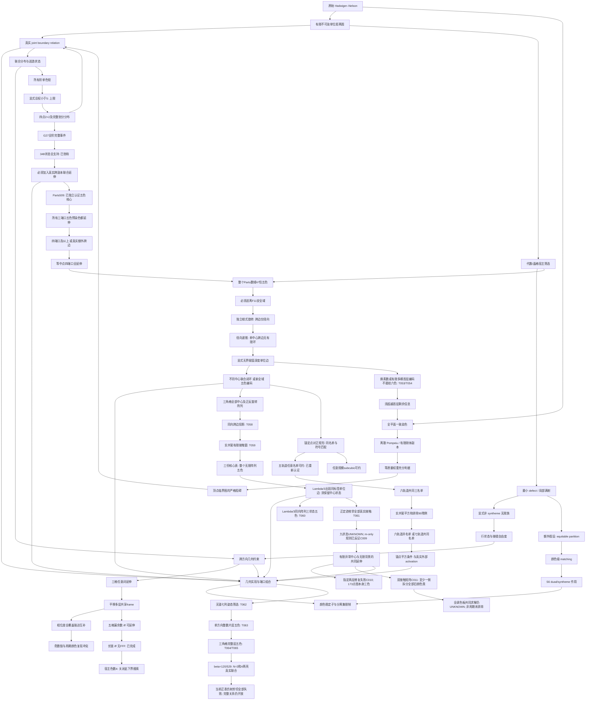

# 路线、分支和结构关系

## 历史压缩

直接高色图搜索 -> 代数宿主筛选 -> 边界 relation -> pair alphabet / wheel
defect -> 几何端口与可动性 -> 5/6/7 局部商图 -> syntheme / seam 猜想。
历史 R4 的条件矛盾指向联合状态与 activation 缺口；当前没有重放其原始证书。
详细历史保留在 references 中，当前结论只以本仓库证据为准。

## 当前最多三个活跃方向

最新收敛见`proofs/triangular_field_stacks.md`。T064/T065已将五色
上界推进到所有`β=α²∈A`且`β>1/4`的整个`K²+αΛ`，包含前轮
三角格多方向宿主，不必解决原484点奇偶商。机制是中心剪切正表、
平方剩余的加法片层约化以及非平方剩余的单壳互斥，不是加搜索预算。
这类阵列停止扩规模。新具体候选`α=2√30/23`落在高度门槛下，
N=3、4两壳同时存在；当前一张正表的14641仿射剪切均失败，但
其它正表、非线性中心编码和实际宿主色数未决定。非平移姿态保留
为第二入口；T066已证明二次旋转系数逃域必有唯一虚拟K枢轴，
因而仍受T052限制，不预设“没有实际共享点”就提供新自由度。

最新优先级及证明见`proofs/free_pose_and_field_stacks.md`。T062将
锁域筛选扩到无共享锚点的任意刚体：七列满秩锁域，秩六至多二次
两分支（每定向）。T063关闭满足高度及跨位移积分条件的整个K²
单方向整数平移层，不限核心或层数；不再扩大这类宿主。
保留非平移秩六二次姿态的联合几何与多方向层间接触；484点双方向
奇偶商UNKNOWN不算下界。独立根式锚定轨道解耦已在T033，不重复立项。

C010已认证指定背景的F_2修复失败，但其173点实际反例本身恰三色，
不提供六色候选。C011以完整5×5单位/重合矩阵关闭“两侧各留一个
旧类单色”的全部换色；仅要求至少一侧拆分所有五个旧类，不要求
两侧同时如此，且不依赖换色分量有限。10份单点改色排除冻结误读。
自由背景补丁与暖启动九状态模型仍UNKNOWN。本轮收敛见
`proofs/background_repair_obstruction.md`；停止扩搜已被C011覆盖的
颜色对方案，不把增加预算当进展。任意有限支持修复仍未被关闭。

T060关闭`Λ/3`单取向阵列：其全部跨边可投影到P□K3，三状态
即五染。真正未决的是双取向合并；T061已认证所有接触坐标，
不用再猜边集。C009排除丢掉n信息的m mod3规则，九状态搜索仍
UNKNOWN，三个有限探针均五色。下一个具体攻击是有限异常中心的
修复能否接到远处三状态背景，见`proofs/refined_center_arrays.md`。

T058/T059关闭给定Parts、角度cosθ=5/8和**全部三角格中心**的
单/双共轭阵列，不再增加这个宿主的半径或副本数。实共轭使异向
接触局限在有限窗口，同向跨边则投影回核心。见`proofs/multicenter_arrays.md`。
下一具体下界入口是细分中心`Λ/3`：一条已精确证明的同标签单位边
使当前中心无关公式失效，须完整保留中心状态。未声称该宿主高色。
C008同时排除只给一份核心染色换frame来判断完整图可染性的做法。

T056/T057已将有限多模首层限制推广到任意有限精度，含分歧素理想。
见`proofs/higher_residue_precision.md`。下列先前重审所留的“更多
有限位数”分支现在关闭；上界候选必须超越整个有限精度编码类。
数域上无统一精度的自适应、各向同性、2进及非约化方法仍开放。

最新优先级见`proofs/pair_framework_priority_v4.md`：第一为真实联合
几何＋全部边界关系的五色排除；第二为超越有限多模有限精度的普适上界；
六色非(4,6)-choosable核仅作储备，T055先排除所有二分核。
均匀Bad比例可由重复核心人为提高而保持χ=4，不再作为单独推进指标。
T053用14个小素数幂筛选及正确Weil谱界，T054再用CRT边满射和
张量谱界，关闭四种既有逃域扩张的所有奇数各向异性单模/有限多模
首层≤6色编码。不是新HN界；高阶有限位数已由T057接续关闭。

T051/T052新增优先筛选：K模板的两位置锚定，或单枢轴＋秩2跨边，
都会把姿态锁回安全域；逐步闭合的整个网络已无条件五色。因此
当前gate全部边界直接固定在Parts的路线被几何上界关闭，不必先
问其坏关系能否activation。真正剩余的是安全域闭包不能吸收的
联合几何；单枢轴非平凡逃域精确缩为秩1二次分支，未共享枢轴仍开放。
见`proofs/pose_field_lock.md`。低姿态秩不等于完整颜色可延伸。

T049已完整关闭“两侧同名单却没有强制单点的七匹配障碍”；T050
把(o,f)联合关系压成两个显式禁止对条件。非均匀C007确实出现
单边检查看不到的两接触矛盾，但仍有单点修复。当前不再优先制造
更多安全域内条件坏例，下一步应直接联合求解真实宿主的全部边界
或证明其普适逃逸；算术上界主线仍独立。见`proofs/spindle_joint_support.md`。

T048进一步关闭私有边界、仅根接触的≤4总gate网络：翼端口的新色
重染恢复完整根三名单，再用根图2-degeneracy延伸。其一般形式允许
任意多个具有独立选点证人的模块。E024显示T047指定坏边界的52种
单点修改已有48种修复；C006说明同类根冲突即使域外也仍可单点修。
所以当前优先的是**多接触的联合支持**或真实阻止这种重置的边界/
宿主结构，不再把仅根接触的双模块作为下界候选扩搜。
量词和全部有限证据见`proofs/root_contact_repair.md`。

最新收敛见`proofs/interface_synthesis_v2.md`：主线只保留两条——
离域后的真实接触点支持/activation，及算术扩域的普适五色上界。
T046–T047已实际证实：NAE可行性摘要丢掉唯一根色，七条匹配跨边
使两个各自可延伸的gate联合不能延伸一份合法边界；全图仍χ=4。
因此不先扩坏gate数，也不先穷举26点边界；先过安全域与全部边界
逃逸量词。rooted_coupled_gate.md为证明入口。
下面clean模板的8门槛保留为筛选，不再是默认下一次搜索规模。

T042已进一步关闭七初始坏gate，且T043把一次修复精确编译为正击中、
负全选和独立性CNF。当前指定21点模板候选必须至少八坏gate；同色
Property-B候选另须通过T044交叠≤2与T045点对复用≤8的几何必要条件。
见`proofs/seven_gate_repair.md`和`proofs/geometric_repair_hypergraph.md`。
下面T040的七个门槛是此前检查点，已由T042加强。

v3重审后的优先切入：constant-pair activation须逃过T038三点/临界点
修复与T039共同色Property-B修复；Parts单模块路线已被T026关闭。
指定21点gate几何还受T040约束：四色宿主的每份四色染色必须至少
激活七个gate，才可能出现五色矛盾；至多六个总能少量重染修复。
任意4-port仍开放，但应面向不同坏关系或联合接口。完整八路线比较
见`proofs/v3_route_reassessment.md`，不默认沿用下方旧优先级。

1. **逃域后的联合延伸**：K(√13)、cosθ=5/8。锚定二点分支收紧到
   六轨道非均匀名单或至少七轨道共同三名单；去低度后需四度分支、
   锚点平方条件与真实activation。未锚定新点不受这批可约性定理覆盖。
2. **相反的上界方向**：是否存在兼容任意赋值深度的五色编码。T028只解决
   保留F11各向异性剩余域的宿主，不覆盖上述新域，更不覆盖实平面。

六色最小defect、长链与G27矩路线保留结果和开放问题，但不再列为当前
活跃计算。既有群作用/分离集/分数上限作为两条主线的前置筛选。

## 需要保留的负路线

- 任意加大同向三角格：已有三染色。
- 最小 defect 自动给 syntheme：显式反例；对径限制也不够。
- 无参考色框架的确定性 duad -> syntheme：颜色稳定子阻碍。
- 单点连接可以独立传输整个 pair：需要先过分离集引理。
- 普通 fractional 下界直接越过 5：外部已有小于 4.36 的上界。
- geometric fractional加任意阶单色全等约束越过5：T023显式可行分布排除。
- Moser平移层链扩大后得到无条件高色图：T022给出整个无限宿主的四染色。
- 给相同G27继续增加全等事件阶数以排除候选划分：T025已经有全部阶数
  完整事件下的348项严格正分布。极点性也不能迫使样本确定性全等不变。
- Parts509五色核心自动锁定三端口或提供非单位点对约束：T026精确反证。
  每次共享≤3点、且无额外跨单位边的有序诱导副本粘合仍恰五色。
- 在K=Q(√3,√5,√11)内增加任何点、分母、核心副本或真实跨边以搜六色：
  T028整个K²五色直接排除。安全扩域（例如√14）也无效。
- 只因为加入√7/√13/√17/√41就认为双核心应更高色：四个E016候选
  均恰五色；新根式非免费activation，单中心跨边受T029径向限制。
- 只由四个生成单位向量的 Cayley 低色结果，推出整个加法宿主的所有
  单位边低色：不成立的推理，必须区分指定方向边和所有单位边。
- 把不平衡Galois符号环当成颜色frame矛盾：C004七点反例排除。
- 在≤5锚定点对、任意subcubic锚定点对网络、或六点对共同三名单中
  搜坏边界：分别由T033/T034/T036关闭。量词与锚点假设不能省略。
- 把无界赋值深度推出“必须无限状态”：T030没有该结论，T031的跨边
  图仍可二染；旧固定窗口失效与任意有限编码失败是不同命题。

## 收敛记录

第 1 轮：从“15 状态很漂亮”改为检查 S6 作用及真实无限相。
具体构造比维数计数更有约束力；matching 需要额外的角色一致性。

第 2 轮：三个周期UNSAT没有被升级为定理；开放patch提示换周期，得到
24格非二分伙伴支持。对径反例压缩成完整二进制条纹族。
因此将最小defect分类与equitable分类分开，后者由详细平衡恢复matching。

第 3 轮：颜色稳定子统一解释“信息与可动性”的部分限制；离散Pompeiu
提供新充分判据，但顶点临界性立即证明一大类种子不适用。暂不扩建大规模
线性搜索，将剩余重点收敛到完整joint relation和跨方向接缝。

第 4 轮：Moser角两格接缝枚举没有删除任何二进制词对。代数系数比较进一步
给出整个无限接触集合只有六条边，升级为两无限序列延伸定理。已停止扩大
同角半径；后续攻击三模块共享frame的联合相容，而不是重复单接口试验。

第 5 轮：同原点第三方向没有闭环新边，平移三格虽然引入无限匹配边仍
全部可延伸。把匹配边压缩成“相位差支持”后，四平移层加中央格产生了
真正的联合限制：三个全覆盖接口强迫奇数次三色块互补，而中央格要求
首尾有共同颜色。均匀两相子类已经完整分类，负例正好是两种交替层序。
进一步用局部归一化和约束单调性，把一般词的充分方向压缩到1536个
最大约束输入，全部获得独立检查的正见证。因此五格任意二进制词已经
完整分类：至少一个漏余数接口恰好等价于可延伸。保留相位差支持/局部
端口状态，下一轮问长链的可组合关系；不要回到单接口状态计数，也不要
把T005假设升级为任意平面染色的activation。

第 6 轮：长链的包含剪枝在36个集合上闭合，再压缩成53→39→11→0
及漏余数重置恒等式，完整解决有限和双向无限指定词延伸。方法与成熟
antichain自动机验证吻合，不将算法本身称作新数学。同时显式四染色
封住该宿主的无条件下界方向。转向full joint时，先证明所有阶单色矩
仍有统一<5可行解，再用四点正方形证明2+2相关性确实是新增信息。
因此下一对象是颜色划分分布，而非继续添加单色矩或Moser格点。

第 7 轮：独立重放G27原对偶，验证168紧项的支持必要性；然后不再局限
四点2+2，枚举全部部分全等并比较完整划分分布。得到三项非确定性极点，
以及覆盖全部348候选四块划分的严格正有理分布，两个见证均由不同几何
算法的标准库检查器认证。这使固定G27的事件加阶方向完全饱和；下一步
转向新几何点或跨副本联合延伸，而非在同一配置上继续换观测量。原问题
所需五色矛盾尚不存在，不将此次四色校准升级为五色下界进展。

第 8 轮：先把真实五色核心资格做成完全离线可检查对象：精确多二次域
几何、显式五染色、原公开否定证明转换后的92649步RUP。再测试实际
五色端口关系，全部两点和三点模式可延伸，指定双六边形的完整13点
边界也无额外限制。由三端口普适性得到低交叠粘合的明确无升级定理，
同时严格保留“无额外跨单位边”和“共享点的旧染色合法”条件。下一步
只测试四端口以上联合状态或新增真实跨边；“核心确实五色”不是activation。

第9轮：等中点四端口全延伸后，改问算术宿主而非继续端口规模。重新
找到并读取Madore赋值约化，独立有限表与Parts下界给出整个K²恰五色，
一次关闭任意同域组合。转测四种不安全二次旋转，全部双核心仍五色；
比较根式系数证明跨边只来自共线原向量。再把11进各向异性失效落实为
T030任意深度的真实单位边族，T031进一步证明单中心非公共跨边无有限
环。现在的瓶颈是不同中心关系的共同延伸及
无界赋值层，而不是旧核心的额外端口。完整5/6/7评估和跨领域选择依据
在proofs/research_synthesis.md。当前仍无平面新界。

第10轮：完整重读历史总账、fetch对齐cb8d1cf后，找回两份Abelian/
reducibility原报告。五轨道重新生成并独立核验，不靠旧证书标签。
锚点正规形与list-Brooks关闭任意规模subcubic子类；七点C004区分
Galois符号与颜色frame。随后完成六轨道共同三名单的全空间覆盖，
90个非三染残例由实共轭平均的平方和矛盾T035统一消除，得到T036。
因此共同三名单候选至少七轨道，六轨道仍可能在非均匀名单层有缺口。
不把此子类分类冒称历史六轨道全延伸重放；新的精确前沿和路线选择
见proofs/history_frontier_remap.md及proofs/six_pair_trace.md。

本轮框架收敛：全文重读2213行参考后，将宿主上界、精确接口与全局
量词分开；成熟实闭域转移说明算术路线原则上能覆盖HN，但仅特定
数域不够。T046根支持短证明＋T047的40点严格关系见证回答了一个
具体机制问题，代替继续提高模板内修复门槛。条件坏边界仍有全图
四色逃逸；下一个核心缺口是离域几何和真实宿主activation，不是
重新命名cascade、sign holonomy或reconfiguration separation。
