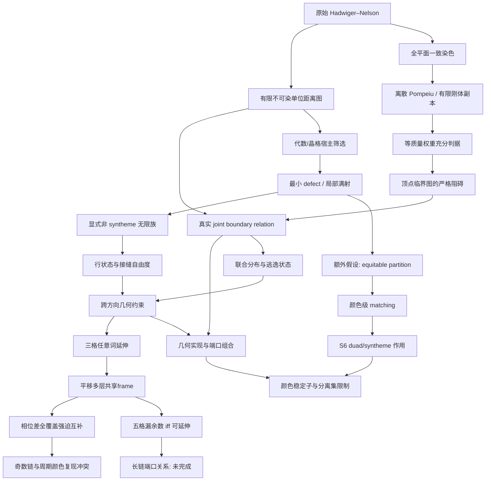

# 路线、分支和结构关系

## 历史压缩

直接高色图搜索 -> 代数宿主筛选 -> 边界 relation -> pair alphabet / wheel
defect -> 几何端口与可动性 -> 5/6/7 局部商图 -> syntheme / seam 猜想。
历史 R4 的条件矛盾指向联合状态与 activation 缺口；当前没有重放其原始证书。
详细历史保留在 references 中，当前结论只以本仓库证据为准。

## 当前最多三个活跃方向

1. **六色状态分类**：最小 defect 与 equitable 的缺口。找显式无限族，
   不以小环面的 UNSAT 代替无限不存在性。
2. **关系编译的必要条件**：颜色置换、分离集、低色宿主与精确几何。
3. **跨领域收敛**：symbolic dynamics、equitable partitions、群作用、
   离散 Pompeiu。只有产出具体命题或计算对象才扩大实现。

## 需要保留的负路线

- 任意加大同向三角格：已有三染色。
- 最小 defect 自动给 syntheme：显式反例；对径限制也不够。
- 无参考色框架的确定性 duad -> syntheme：颜色稳定子阻碍。
- 单点连接可以独立传输整个 pair：需要先过分离集引理。
- 普通 fractional 下界直接越过 5：外部已有小于 4.36 的上界。
- 只由四个生成单位向量的 Cayley 低色结果，推出整个加法宿主的所有
  单位边低色：不成立的推理，必须区分指定方向边和所有单位边。

## 收敛记录

第 1 轮：从“15 状态很漂亮”改为检查 S6 作用及真实无限相。
具体构造比维数计数更有约束力；matching 需要额外的角色一致性。

第 2 轮：三个周期UNSAT没有被升级为定理；开放patch提示换周期，得到
24格非二分伙伴支持。对径反例压缩成完整二进制条纹族。
因此将最小defect分类与equitable分类分开，后者由详细平衡恢复matching。

第 3 轮：颜色稳定子统一解释“信息与可动性”的部分限制；离散Pompeiu
提供新充分判据，但顶点临界性立即证明一大类种子不适用。暂不扩建大规模
线性搜索，将剩余重点收敛到完整joint relation和跨方向接缝。

第 4 轮：Moser角两格接缝枚举没有删除任何二进制词对。代数系数比较进一步
给出整个无限接触集合只有六条边，升级为两无限序列延伸定理。已停止扩大
同角半径；后续攻击三模块共享frame的联合相容，而不是重复单接口试验。

第 5 轮：同原点第三方向没有闭环新边，平移三格虽然引入无限匹配边仍
全部可延伸。把匹配边压缩成“相位差支持”后，四平移层加中央格产生了
真正的联合限制：三个全覆盖接口强迫奇数次三色块互补，而中央格要求
首尾有共同颜色。均匀两相子类已经完整分类，负例正好是两种交替层序。
进一步用局部归一化和约束单调性，把一般词的充分方向压缩到1536个
最大约束输入，全部获得独立检查的正见证。因此五格任意二进制词已经
完整分类：至少一个漏余数接口恰好等价于可延伸。保留相位差支持/局部
端口状态，下一轮问长链的可组合关系；不要回到单接口状态计数，也不要
把T005假设升级为任意平面染色的activation。
