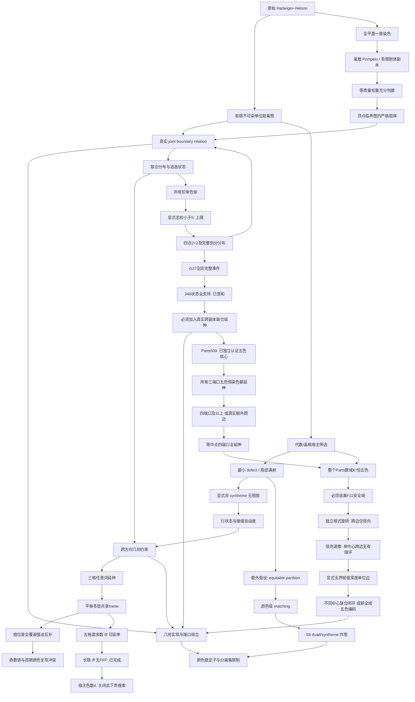

# 路线、分支和结构关系

## 历史压缩

直接高色图搜索 -> 代数宿主筛选 -> 边界 relation -> pair alphabet / wheel
defect -> 几何端口与可动性 -> 5/6/7 局部商图 -> syntheme / seam 猜想。
历史 R4 的条件矛盾指向联合状态与 activation 缺口；当前没有重放其原始证书。
详细历史保留在 references 中，当前结论只以本仓库证据为准。

## 当前最多三个活跃方向

1. **逃域后的联合延伸**：K(√13)、cosθ=5/8，不同中心跨边的完整五色
   关系能否产生不可延伸闭环；T029限制单中心接触，T030打破固定赋值窗口。
2. **相反的上界方向**：是否存在兼容任意赋值深度的五色编码。T028只解决
   保留F11各向异性剩余域的宿主，不覆盖上述新域，更不覆盖实平面。

六色最小defect、长链与G27矩路线保留结果和开放问题，但不再列为当前
活跃计算。既有群作用/分离集/分数上限作为两条主线的前置筛选。

## 需要保留的负路线

- 任意加大同向三角格：已有三染色。
- 最小 defect 自动给 syntheme：显式反例；对径限制也不够。
- 无参考色框架的确定性 duad -> syntheme：颜色稳定子阻碍。
- 单点连接可以独立传输整个 pair：需要先过分离集引理。
- 普通 fractional 下界直接越过 5：外部已有小于 4.36 的上界。
- geometric fractional加任意阶单色全等约束越过5：T023显式可行分布排除。
- Moser平移层链扩大后得到无条件高色图：T022给出整个无限宿主的四染色。
- 给相同G27继续增加全等事件阶数以排除候选划分：T025已经有全部阶数
  完整事件下的348项严格正分布。极点性也不能迫使样本确定性全等不变。
- Parts509五色核心自动锁定三端口或提供非单位点对约束：T026精确反证。
  每次共享≤3点、且无额外跨单位边的有序诱导副本粘合仍恰五色。
- 在K=Q(√3,√5,√11)内增加任何点、分母、核心副本或真实跨边以搜六色：
  T028整个K²五色直接排除。安全扩域（例如√14）也无效。
- 只因为加入√7/√13/√17/√41就认为双核心应更高色：四个E016候选
  均恰五色；新根式非免费activation，单中心跨边受T029径向限制。
- 只由四个生成单位向量的 Cayley 低色结果，推出整个加法宿主的所有
  单位边低色：不成立的推理，必须区分指定方向边和所有单位边。

## 收敛记录

第 1 轮：从“15 状态很漂亮”改为检查 S6 作用及真实无限相。
具体构造比维数计数更有约束力；matching 需要额外的角色一致性。

第 2 轮：三个周期UNSAT没有被升级为定理；开放patch提示换周期，得到
24格非二分伙伴支持。对径反例压缩成完整二进制条纹族。
因此将最小defect分类与equitable分类分开，后者由详细平衡恢复matching。

第 3 轮：颜色稳定子统一解释“信息与可动性”的部分限制；离散Pompeiu
提供新充分判据，但顶点临界性立即证明一大类种子不适用。暂不扩建大规模
线性搜索，将剩余重点收敛到完整joint relation和跨方向接缝。

第 4 轮：Moser角两格接缝枚举没有删除任何二进制词对。代数系数比较进一步
给出整个无限接触集合只有六条边，升级为两无限序列延伸定理。已停止扩大
同角半径；后续攻击三模块共享frame的联合相容，而不是重复单接口试验。

第 5 轮：同原点第三方向没有闭环新边，平移三格虽然引入无限匹配边仍
全部可延伸。把匹配边压缩成“相位差支持”后，四平移层加中央格产生了
真正的联合限制：三个全覆盖接口强迫奇数次三色块互补，而中央格要求
首尾有共同颜色。均匀两相子类已经完整分类，负例正好是两种交替层序。
进一步用局部归一化和约束单调性，把一般词的充分方向压缩到1536个
最大约束输入，全部获得独立检查的正见证。因此五格任意二进制词已经
完整分类：至少一个漏余数接口恰好等价于可延伸。保留相位差支持/局部
端口状态，下一轮问长链的可组合关系；不要回到单接口状态计数，也不要
把T005假设升级为任意平面染色的activation。

第 6 轮：长链的包含剪枝在36个集合上闭合，再压缩成53→39→11→0
及漏余数重置恒等式，完整解决有限和双向无限指定词延伸。方法与成熟
antichain自动机验证吻合，不将算法本身称作新数学。同时显式四染色
封住该宿主的无条件下界方向。转向full joint时，先证明所有阶单色矩
仍有统一<5可行解，再用四点正方形证明2+2相关性确实是新增信息。
因此下一对象是颜色划分分布，而非继续添加单色矩或Moser格点。

第 7 轮：独立重放G27原对偶，验证168紧项的支持必要性；然后不再局限
四点2+2，枚举全部部分全等并比较完整划分分布。得到三项非确定性极点，
以及覆盖全部348候选四块划分的严格正有理分布，两个见证均由不同几何
算法的标准库检查器认证。这使固定G27的事件加阶方向完全饱和；下一步
转向新几何点或跨副本联合延伸，而非在同一配置上继续换观测量。原问题
所需五色矛盾尚不存在，不将此次四色校准升级为五色下界进展。

第 8 轮：先把真实五色核心资格做成完全离线可检查对象：精确多二次域
几何、显式五染色、原公开否定证明转换后的92649步RUP。再测试实际
五色端口关系，全部两点和三点模式可延伸，指定双六边形的完整13点
边界也无额外限制。由三端口普适性得到低交叠粘合的明确无升级定理，
同时严格保留“无额外跨单位边”和“共享点的旧染色合法”条件。下一步
只测试四端口以上联合状态或新增真实跨边；“核心确实五色”不是activation。

第9轮：等中点四端口全延伸后，改问算术宿主而非继续端口规模。重新
找到并读取Madore赋值约化，独立有限表与Parts下界给出整个K²恰五色，
一次关闭任意同域组合。转测四种不安全二次旋转，全部双核心仍五色；
比较根式系数证明跨边只来自共线原向量。再把11进各向异性失效落实为
T030任意深度的真实单位边族，T031进一步证明单中心非公共跨边无有限
环。现在的瓶颈是不同中心关系的共同延伸及
无界赋值层，而不是旧核心的额外端口。完整5/6/7评估和跨领域选择依据
在proofs/research_synthesis.md。当前仍无平面新界。
