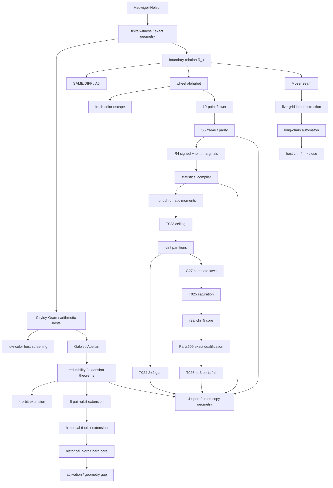

# Hadwiger–Nelson 项目完整历史资产总账

**副标题：历史脉络、定理、构造、反例、计算证书、负结果、概念框架、遗失资产与当前远端硬状态**  
**整理日期：2026-09-08（Australia/Brisbane）**  
**当前远端基线：** `rsgcsg/math-research@588daea30ff9bec6bf6dabea0c8ae5802224d870`  
**原问题状态：** 未解决；当前公开区间仍为 `5 <= chi(R^2) <= 7`。

---

## 0. 这份文档的目的与证据纪律

这不是一份新的路线 brainstorm，而是一份**资产清点文档**。目标是尽可能回答四个问题：

1. 这个项目历史上到底走过哪些路线，为什么转向；
2. 历史上到底证明过哪些定理、构造过哪些对象、得到过哪些证书或计算事实；
3. 哪些历史成果已经在当前远端重新认证，哪些仍只有旧 Markdown / 对话 / package 记录；
4. 哪些失败已经形成可复用的“禁止重复踩坑”资产。

为避免把历史声明和当前硬事实混在一起，全文使用以下等级：

| 标签 | 含义 |
|---|---|
| **[REMOTE-HARD]** | 当前远端 `RESULTS.md/proofs/` 已证明，并纳入现行 theorem ledger |
| **[REMOTE-COMP]** | 当前远端有 exact witness、独立 verifier、重放或有限穷举支撑 |
| **[EXTERNAL-REPLAY]** | 外部结果/证书已在当前项目中独立重放，但不是项目首创 |
| **[HIST-THM]** | 历史项目文档明确记录为已证明，但当前远端未恢复全部原始证明包 |
| **[HIST-COMP]** | 历史计算/证书/枚举记录；当前原 package 未完全重放 |
| **[EXPERIMENT]** | 实验性构造、SAT 观察、候选、数值或未形成 theorem 的结果 |
| **[HEURISTIC]** | 研究直觉、结构猜想、跨领域抽象 |
| **[CLOSED]** | 后续定理/反例已经明确封死或证明继续加规模无意义 |
| **[OPEN]** | 当前仍真实开放 |

**重要：**“历史上做过”不等于“当前远端已认证”，更不等于“公开文献首创”。例如 R4、flower、six/seven-orbit、mod-5/elliptic、若干 direct-attack 构造在旧资料里有相当具体的成果，但当前远端仍把其部分 package 放在“待恢复/待重放”层。

---

# Part I. 项目总脉络：我们实际上换了哪些问题？

## 1. 母问题：从“找一张六色图”开始

Hadwiger–Nelson 问题要求确定平面单位距离图的最大必要颜色数：

\[
\chi(\mathbb R^2)\in\{5,6,7\}.
\]

最初最自然的下界目标是：

> 构造一张有限二维单位距离图，证明它不可五染。

但项目很快发现，直接把点数、边数、坐标代数次数、criticality、SAT 难度越做越大，并不会自动接近 `chi >= 6`。历史的核心演化，实质上是研究对象不断更换。

---

## 2. Phase A：finite-direction / Cayley–Gram —— 先解决“怎样表示几何”

**历史问题：**任何有限 obstruction 只使用有限多个单位方向，能否把无限平面压成有限代数数据？

引入有限生成 Abelian Cayley 宿主、整数 relation lattice 与 rank-2 Gram 表示。若单位方向为 `u_1,...,u_m`，则几何条件可写成

\[
Q\succeq0,\qquad \operatorname{diag}Q=1,\qquad \operatorname{rank}Q\le2,\qquad QM=0.
\]

**历史资产：**

- finite-direction exact representation；
- direction relation lattice；
- rank-2 Euclidean realization 条件；
- 为后续 number field / exact coordinate / Cayley host 提供统一输入层。

**最终定位：**这是非常好的**表示层**，但不是 chromatic obstruction 的解释层。它回答“几何怎样编码”，不回答“为什么五染不了”。

---

## 3. Phase B/C/D：五方向、3-adic、Moser、H25 —— 先学会识别“低色宿主”

项目曾探索：

- 五方向 quadratic shell；
- mod-3 / 3-adic shell；
- Moser lattice / cyclotomic ring；
- 有限域单位距离图 `H25`；
- Fourier / spectral / pairwise correlation。

这些路线最大的历史价值不是制造六色图，而是形成长期原则：

\[
\boxed{\text{代数复杂、边很多、对称性漂亮，并不等于颜色表达力强。}}
\]

`H25` 更出现路线反转：最初被当作下界 spectral probe，后来反而成为解释某些真实坐标环为何可五染的**上界模型**。

**[CLOSED/降级]** 在任何大规模 host 搜索前，必须先证明/检索 ambient 的 chromatic ceiling；Moser ring、低方向 Abelian host 等不再作为主下界宿主。

---

## 4. Phase E/F/G：SAME/DIFF、critical graph、A6 —— 从色数改成“还差什么关系”

项目第一次决定性转向，是不再只问 `chi(G)`，而问一个模块能强迫什么 terminal relation。

基本二元关系：

- `SAME_k(x,y)`：所有 proper k-colorings 中 `x,y` 同色；
- `DIFF_k(x,y)`：所有 proper k-colorings 中 `x,y` 异色。

由此形成 compiler–amplifier 架构：

1. 小模块编译颜色关系；
2. 用 Euclidean isometries 拼接多个副本；
3. 关系在全局上矛盾。

同期定义 augmentation distance `A_6(n)`：一张真实 n 点 unit graph 至少再加多少非单位 disequality 才不可五染。

\[
A_6(n)=0 \iff \text{存在 n 点不可五染 UDG}.
\]

**历史资产：**

- `A_6(n)` 作为“几何离六色逻辑还有几条关系”的诊断量；
- critical edge / SAME compiler 与 6-critical graph 的联系；
- 小点数 6、14、15、16 等历史搜索的结构化解释。

**后来发现的局限：**

\[
\boxed{\text{graph-theoretic defect 小} \not\Rightarrow \text{information novelty 高}.}
\]

一个 gadget 即使离 abstract 6-critical 很近，产生的 pairwise inequality 也可能只是 PSD/simplex shadow。

---

## 5. Phase H：correlation / PSD / higher moments —— 发现“压缩信息会丢东西”

有限颜色关系可以通过随机刚体移动转成同色概率/相关不等式。项目曾尝试用 pairwise Fourier/Bessel/PSD 直接逼 lower bound。

历史校准显示：

- 某些六点 binary compiler 很紧，但 pairwise inequality 没有新信息；
- 7-wheel 第一次出现超出最简单 PSD shadow 的结构；
- 后续所有工作逐渐转向“必须知道自己在 projection 中丢了什么”。

这一步最终导向 boundary relation、joint marginals、T023/T024/T025。

---

## 6. 真正的母对象出现：完整 boundary relation

对有限 UDG `G` 和端口 `P`，定义

\[
\mathcal C_k(G)=\operatorname{Hom}(G,K_k),
\]

\[
R_k(G,P)=\{c|_P:c\in\mathcal C_k(G)\}.
\]

以后几乎所有历史对象都可以视为 `R_k` 的不同 quotient / shadow：

- SAME/DIFF：二元 relation；
- wheel state：小端口 partition quotient；
- list coloring：boundary 颜色被外部占用后的 relation；
- pair alphabet：颜色对的 `S_k`-自然商；
- frame/parity：保留局部颜色坐标系的相对对齐；
- R4：循环 relation join / marginal hierarchy；
- Galois reducibility：一类几何模块的 universal extension theorem；
- Parts509 ports：真实 `chi=5` 核心的 exact projection。

这是目前最稳定的历史母框架。

---

# Part II. wheel / fresh color / flower / frame：五色世界为什么如此容易逃？

## 7. 七点 wheel：项目最持久的小探针

中心加正六边形形成 7-wheel。中心占掉一种颜色后，外圈只有 `k-1` 色。

若把外圈同色非单位点对称为 defect，则当前远端精确证明：

\[
\boxed{D_{\min}=7-k,\qquad k=5,6,7,}
\]

并可达（T001）。历史 5/6/7 三相的局部“颜色短缺量”由此统一。

六色情况 `D=1` 时唯一 defect 只可能是：

- 长度 `sqrt(3)` 的弦；
- 长度 2 的直径。

这催生 monomer–dimer / defect-routing 直觉，但后来证明仅靠 minimal defect 不会自动产生全局 matching。

---

## 8. wheel alphabet：31 个有向 partition / 9 个几何 orbit

**[HIST-THM/HIST-COMP]** 历史项目把五色 7-wheel 的 equality pattern 压成：

- 31 个 oriented partitions；
- 进一步除几何对称得到 9 个 orbit。

这是第一个真正可操作的颜色字母表。

历史对 de Grey J/K/L/M、1581 图中的大量 geometric wheels、Parts509 的相关接口做过 exact extension 扫描，得到长期结论：

\[
\boxed{\text{高 chromaticity 与 terminal rigidity 是两种不同资源。}}
\]

单 wheel 在很多真实五色图里仍支持全部或几乎全部状态。

---

## 9. fresh fifth color：第五色最重要的不是“多一个标签”，而是“擦除信息”

历史上一个关键修正是：第五色不仅能 split 某个旧颜色类，更一般地能把任意 independent set 重新染成 fresh color。

后果包括：

- 暂时减少/恢复 palette；
- 让局部 frame 从 full palette 经 palette collapse 后重新编码；
- 翻转某些 parity 信息；
- 把四色中很强的 terminal forcing 在五色中放松成全关系。

因此历史形成的原则是：

\[
\boxed{\text{任何五色 gadget 必须对 fresh-color escape 鲁棒。}}
\]

仅仅“接口用了五种颜色”并不等于接口被保护。

---

## 10. 19 点 seven-wheel flower

**[HIST-COMP，当前原始 package 待重放]** 历史构造：

- 19 个点；
- 42 条 unit edges；
- 7 个自然 wheels。

对某个特定 wheel state（历史称 state 2）：

- 单个 wheel 处于该状态可延伸；
- 指定至多 6 个 wheel 同时处于该状态仍可延伸；
- 7 个全部同时处于该状态时 UNSAT。

这是项目第一个非常干净的

\[
\boxed{\text{局部都可行，完整 relation join 却为空}}
\]

范式。

后来历史工作把 transfer-matrix contradiction 压成 `Z_2` parity 解释：active overlaps 强迫 sign flips，而 flower 的 active incidence 出现奇环/三角形，因此无法给所有局部 frame 一致赋号。

**结构价值：**它把 primitive 从“找一个很硬的局部状态”改成“找若干弱 relation 的联合不可实现”。

---

## 11. 61/62-state color-frame calculus

**[HIST-THM/HIST-COMP，当前未完全重放]** 在 31 个 oriented wheel partitions 上加入局部颜色 frame parity：

- 30 个非退化 oriented states 各有两种 parity lift；
- state 0 只暴露 3 种颜色，剩余两个隐藏颜色可交换，parity 不可观测；
- 因而实际 observable signed states 为 `1 + 30*2 = 61`；
- 为统一 transport，在计算中保留 state 0 的两个不可区分 lifts，得到 62-state lift。

### 11.1 Frame observability lemma

若 `k` 色局部接口实际暴露 `r` 个颜色，则隐藏 stabilizer 为 `S_{k-r}`。

五色情况下，parity 要从边界可观察，必须使隐藏 stabilizer 中没有奇排列，因此恰要求

\[
5-r\le1\quad\Longleftrightarrow\quad r\ge4.
\]

所以：

\[
\boxed{\text{五色 parity 可观察 iff 接口至少暴露四种颜色。}}
\]

### 11.2 Overlap transport lemma

两个相邻局部在共享物理点上看见 `m` 个不同颜色角色时，partial color bijection 延伸为完整 `S_5` permutation 的数目为

\[
(5-m)!.
\]

因此：

- `m=4`：唯一传输，信息完整；
- `m=3`：恰两个传输，且 parity 相反，相当于 sign eraser。

### 11.3 Triangle-flatness lemma

历史 8882 个有限检查后来被压成群论证明：三个两两相邻 wheel 围成物理单位三角形时，沿三条 transport 得到的 `S_5` holonomy 必为 identity。

理由：公共单位三角形固定三个颜色角色；cycle permutation 为偶；固定三点后的 stabilizer 是 `S_2`，其中唯一偶元是恒等。

### 11.4 Simply-connected integration theorem

在 simply-connected wheel complex 中，若：

1. 每条相邻边满足局部 transport relation；
2. 同一物理点在各 wheel 中的 occurrence graph 连通；
3. 每条真实 unit edge 至少被某 wheel 覆盖；

则从任一 base wheel 的 frame 出发沿边传播，triangle-flatness 保证 path independence，最终得到全 union 的 proper five-coloring。

**含义：**在这类 wheel complex 中，真正 obstruction 必须已经存在于局部 transport selection / relation join，而不是依赖一个神秘未见的大尺度平坦 holonomy。

---

## 12. R4：signed / marginal / Farkas 校准器

**[HIST-COMP，远端 E004 明确标记原 package 未恢复]** 历史 R4 条件模型中：

- 只保留 unsigned/oriented partition 时 SAT；
- 加 signed/frame consistency 后 UNSAT；
- negative elementary triangle / unbalanced signed-gain structure 出现；
- 单轮 marginals 可满足；
- 保留相邻双轮 joint marginals 后系统 infeasible。

历史资料还记录：

- 29-node proof tree；
- 56-point conditional core；
- exact Farkas dual；
- 3440-event escape ledger。

这些具体 package 当前未在远端完成重新认证，因此保持 HIST-COMP 等级。

R4 的关键教训不是“R4 图不可五染”——它有人工 phase/domain restriction——而是：

\[
\boxed{\text{低阶 projection/marginal 可以全部可行，而完整 joint 已经矛盾。}}
\]

### 12.1 signed-gain 解释

固定一个 admissible orientation field 后，所有四颜色可见 overlap 边带一个符号 `sigma_e`。存在 vertex frame signs 当且仅当所有 cycle sign product 都为 `+1`，即 signed graph balanced。

历史进一步提出 frame-frustration index `beta` 作为 lower/upper 的共同量：lower 寻找不可避免的 frustration，upper 寻找最小 repair。该参数属于 **[HEURISTIC/PROPOSED]**，不是当前 theorem ledger。

---

# Part III. Statistical compiler / boundary list / direct attacks

## 13. Statistical compiler

历史建立的目标：对一个有限 patch 的**全部真实五染色**赋概率，并要求全等子配置具有一致的 partition marginals。若该线性系统 infeasible 且有有理 dual，则通过 amenability / Folner averaging 把有限 dual 放大成真正 finite obstruction。

这条路线形成了一个重要证据纪律：

\[
\mathcal A\subseteq\mathcal C_5(P)\subseteq\mathcal B.
\]

- `A` 是只枚举某类显式染色的 inner approximation：`A` 空不能推出真正不可五染；
- `B` 是只保留局部 marginals 的 outer relaxation：`B` infeasible 才是真矛盾，`B` feasible 可能是假解。

4 点/5 点校准、3137 图与 R4 都曾用于暴露这两种量词错误。

---

## 14. 18 点 bad 3-list core

**[HIST-THM/HIST-COMP]** 三角格上的 18 点核心：

- 普通三色可染；
- 给每点指定一个 3-element list 后不可染；
- 删除任意顶点或恢复任意一个被禁颜色，又恢复可染。

这证明：

\[
\boxed{\text{低 ordinary chromatic number 不代表 boundary/list relation 弱。}}
\]

---

## 15. 54 点预染色几何模块

**[HIST-COMP]** 通过给 18 点核心加入私有单位邻点，把 list restrictions 编译成真实 unit geometry 的预染色边界，得到某个明确 bad boundary

\[
b_{\rm bad}\notin R_5(G,B),
\]

但 `R_5(G,B)` 本身非空。

这把历史缺口说得极其清楚：

> 我们已经会造“某些钥匙打不开的房间”，还不会让外部几何只能产生这些坏钥匙。

即 activation / boundary compiler gap。

---

## 16. 3137 / 6049 / 9431 / 12277 / 9765 等 direct-attack 资产

这些构造的重要性主要是“负经验资产”，不应只按点数排序。

### 16.1 3137 点基图

**[EXPERIMENT/HIST-COMP]** 曾经成功破坏一批漂亮的 additive / finite-field coloring formulas，但仍存在普通五染色。

**教训：**杀光一个漂亮公式族不等于杀光所有五染色。

### 16.2 6049 点图

**[HIST-COMP]** 从 3137 点基图加入大量至少有五个旧单位邻居的新点，得到：

- 6049 点；
- 37838 条 unit edges；
- 452 个新点同时阻断历史保存的旧染色。

最终仍找到完整五染色。

由此形成最直观的量词警告：

\[
\exists\text{ 很多旧染色被杀} \not\Rightarrow \forall\text{ 五染色被杀}.
\]

历史还定义 blocker quantity

\[
b_k(P,S)=\min_{c\in\mathcal C_k(P)}\#\{s\in S:c(N_P(s))\text{ 用齐 }k\text{ 色}\}.
\]

6049 的关键失败可概括为 `b_5=0`。

### 16.3 9765 点扩张

**[HIST-THM]** 曾经是 UNKNOWN，后被 mod-5 coordinate-ring theorem 给出显式五染色，成为“算术 ceiling 可以直接关闭大候选”的代表。

### 16.4 9431 / 12277

**[EXPERIMENT/HIST-COMP]** 旧索引记录为 field-growth / quadratic-Galois 分支中的大型真扩域和 bridge 实验。当前挂载文档没有恢复所有坐标/证书细节；它们最重要的历史意义是进一步否定：

- 点数多；
- unit-edge 多；
- 三核高；
- 数域次数高；

这些量都不能单独作为“接近六色”的 order parameter。

### 16.5 11 点 / degree-8 bridge

资源索引明确记录在 `HN_quadratic_branch_separation_and_orbit_classification_2026-09-07.md` 中。当前原报告未挂载，保留为**待恢复构造资产**，不在本总账中补写未经当前来源支持的细节。

---

# Part IV. Arithmetic ceiling / local reduction / finite-field assets

## 17. mod-5 coordinate-ring ceiling

**[HIST-THM，当前远端未重放 package]** 项目历史证明一大类实坐标环可通过保持单位距离方程的环同态约化到 `F_25`，再拉回有限域中的显式五染色。

它曾直接解决 9765 点候选的 UNKNOWN。

这条 theorem 的真实作用是**搜索前 host screening**：某些看起来极复杂的 radical coordinate sets，因为存在 mod-5 quotient，整体天然可五染。

---

## 18. finite-field linear coloring 的 elliptic threshold

**[HIST-THM]** 历史把 `F_{q^2}^2` 单位二次型图的 `F_q`-线性 q-coloring 条件转成 genus-1 curve 的点数问题，并得到：

\[
\boxed{F_{q^2}^{\,2}\text{ 的单位二次型图有 }F_q\text{-线性 }q\text{-染色 iff }q=3,5.}
\]

关键机制：坏单位方向对应某 elliptic curve 的额外有理点；Hasse 型界在 `q>=7` 时排除极端情形。

**意义：**解释为什么“5”在一类算术宿主上异常稳定，而不是给 HN 下界。

---

## 19. intrinsic local reduction

**[HIST-THM/方法资产]** 后续历史工作意识到“坐标表达式有没有分母 5”不是坐标不变量，于是把 mod-p 筛选改成 squared-distance valuation/integrality 条件。

这是从“看公式”升级成 intrinsic geometry criterion 的典型路线成熟。

---

# Part V. Galois / finite Abelian / reducibility theorem library

## 20. 三旧邻居锁域

**[HIST-THM]** 若旧点坐标在数域 `K`，一个新点与三个非共线旧点距离都为 1，则距离差给出两条线性方程，唯一确定新点，因此新点仍在 `K^2`。

\[
\boxed{\text{大量高旧度补点无法真正让坐标域增长。}}
\]

这推动项目从“逐点加根号”转为低旧度但联合互连的 batch field extension。

---

## 21. quadratic branch separation

**[HIST-THM]** 真正属于不同二次扩域分支、又各自锚定旧域的新点之间，unit-edge 受到强域继承限制；“加很多独立根号”经常只把图拆成几乎不交互的分支。

---

## 22. 完整 sign-orbit / hypercube 分类

**[HIST-THM]** 独立平方根分量直接相加形成的完整正负号 orbit，其内部 unit graph 是若干 hypercubes 的不交并，因此至多二色。

这第一次系统排除“一个代数次数很高的完整 orbit 自己会高色”的想法。

---

## 23. 单位四边形必为菱形

**[HIST-THM，结构极重要]** 若四个不同平面点依次形成单位四环，则

\[
\boxed{a+c=b+d.}
\]

这是后续 finite Abelian classification 的核心，历史上被认为比繁琐根式展开更自然成熟。

---

## 24. finite Abelian Cayley planar unit-distance classification

**[HIST-THM]** 若有限 Abelian Cayley graph 有单射平面 unit-edge 实现，则每个连通分量只能是

\[
C_{n_1}\square\cdots\square C_{n_r}\square K_2^{\square s}.
\]

因此 ordinary chromatic number 至多 3；所有 cycle factors 偶时至多 2。

**结构证明核心：**群交换产生 commuting squares；每个单位四环由菱形恒等式使 mixed finite difference 消失；有限 torsion 再强迫 product decomposition。

---

## 25. 单个 real Abelian Galois orbit

**[HIST-THM]** Galois group 在完整 orbit 上给出有限 Abelian Cayley action，因此单个 orbit 自动落入上面的 product classification，故内部至多三色；多二次 sign orbit 更常退化成 hypercubes。

\[
\boxed{\text{单 orbit 的代数复杂度不是六色来源。}}
\]

困难只能来自多个模块共享同一套 palette 的交互。

---

## 26. unified boundary list for Galois orbits

**[HIST-THM/框架资产]** 若旧点被 Galois action 固定，则同一新 orbit 中的点具有相同旧单位邻居，因此产生相同允许颜色名单。

这极大限制了真实几何可实现的 list assignments；抽象 list-critical 反例不能直接搬进 Galois geometry。

---

## 27. anchored orbit lemma

**[HIST-THM]** 在旧域含 `sqrt(3)` 的条件下，非平凡 orbit 若有旧单位锚点，则内部一旦出现单位边，会强迫完整六边形型轨道结构。许多 2-power orbit 因而反而是 independent set。

---

## 28. 四个 anchored orbit universal extension theorem

**[HIST-THM]** 在明确 Galois/anchor 假设下，至多四个这样的新 orbit，总能保持任意指定旧五染色不变地延伸。

历史证明主要使用：

- 每 orbit 至少剩三种允许色；
- Hall SDR；
- 少量低度例外；
- Brooks theorem。

这是项目第一次真正具有“四色定理 reducibility”味道的结果：不是证明模块自己低色，而是证明它**对任意旧边界都可约**。

---

## 29. 五个 anchored two-point orbits：59049 finite proof cases

**[HIST-THM/HIST-COMP]** 每个 orbit 有两个点；任意两 orbit 之间在 Galois 对称下只有三种连接：

1. 无边；
2. straight/parallel matching；
3. crossed matching。

五 orbit 有 10 对，raw space 为

\[
3^{10}=59049.
\]

历史完整分类记录：

- 含 `K_{2,3}` 的类型：几何不可能；
- 含 `K_4` 的类型：几何不可能；
- 剩余一个 `C_{10}^2` 型例外：由菱形线性恒等式排除；
- 其余全部 list-colorable，并保存 explicit positive witnesses；
- 非均匀名单进一步归约成四类频数，历史记录有 196740 份正见证。

因此历史结论：

\[
\boxed{5\text{ 个 anchored two-point orbits 不能阻断任意旧五染色。}}
\]

---

## 30. 六个 two-point orbits：历史完成到更高一层

**[HIST-THM/HIST-COMP；本轮没有原始 package，必须恢复后重放]** 共享项目先前历史记录称：在旧 Galois/anchor 假设下，六个 nontrivial two-point complete orbits 仍然总可延伸。

历史参数：

\[
3^{15}=14,348,907
\]

个 raw matching-type possibilities，经轨道/颜色对称、`K_{2,3}`、`K_4`、菱形方程等几何剪枝，被压到约 **1242 个 essential types**；绝大多数由几何禁形或 list-coloring witness 解决，剩余逻辑例外最终被几何不可实现性排除。

**注意：**这一结论来自共享项目历史记录/此前对话总结；当前挂载的主 Markdown 只明确索引到“五 orbit 已完成、六 orbit 曾是下一格”，而当前远端 E004 也未把 six-orbit package 纳入硬账本。因此它必须保持 HIST 等级，不能写成当前认证 theorem。

---

## 31. 七轨道：第一次出现 abstract hard core，但 anchor geometry 没闭合

**[HIST-COMP/历史条件结果]** 共享项目后续记录中，七个 pair/orbit 层第一次出现 pair-critical signed 2-lift hard cores。历史记录的一类核心具有：

- 14 个新顶点；
- 26 条 matching-type unit constraints；
- abstract graph 4-chromatic；
- 删除任意一个 orbit 后恢复 3-colorability；
- 至少存在一个 faithful unit-distance realization。

但是 anchored two-point orbit 还要求每个 fiber pair 的距离 `<=2` 才能同时拥有旧 unit anchor。历史搜索的 12 个几何 realization branches 均有至少一对 fiber 超过 2，最好 branch 的最大 fiber distance 仍约 `2.29089`。

因此七轨道的历史意义是：

\[
\boxed{\text{抽象颜色逻辑第一次真正变硬，但真实 anchor geometry 仍不允许激活。}}
\]

这是项目最清晰的 logic–geometry gap 原型之一。

---

## 32. seven-orbit conditional bad boundary / spindle-list 描述

**[HIST-COMP]** 5/6/7 统一路线图进一步记录：七二点轨道可以形成一个真实 conditional bad boundary；内部并非无条件高色，但某些边界 pair-label 条件激活时不可五色延伸。后续 spindle-list 描述把坏边界压得很清楚：若若干 anchor pairs 全部使用同一对颜色则失败，其他边界可延伸。

因此我们历史上已经做到：

> 造出一个“完全知道哪些钥匙打不开”的房间。

仍然缺的是外部 activation：证明真实外部 `R_5(H,B)` 必须落入坏边界集合。

# Part VI. 当前远端重新建立的硬 theorem ledger（T001–T026）

本节只记录当前 `main=588daea...` 已纳入 `docs/RESULTS.md` 的现行硬账本。它是今后所有新工作应优先依赖的 theorem library。

## 33. T001–T006：wheel defect、显式反例与 equitable 修复

### T001 — wheel 重复超额下界

**[REMOTE-HARD][REMOTE-COMP]** 对 `k=5,6,7`，7-wheel 的重复超额至少 `7-k`，并且可达。

**结构意义：**把 5/6/7 三相统一成一个最小局部 shortage parameter。

### T002 — pair equality 的 D/I 编码

**[REMOTE-HARD][REMOTE-COMP]** 五色中的 `D+I` 与六色中的 `D` 对应历史 pair-equality 定义；有限候选状态已穷举核验。

### C001 — minimal six-color defect 不推出 global matching

**[REMOTE-HARD]** 12-cell 显式周期反例；行增量交替 `2,3`。

### C002 — antipodal repetition 仍不推出 matching

**[REMOTE-HARD]** 任意 binary increments 的无限族；18-cell 周期实例；可保持零额外 defect seam。

### C003 — partner-support 可以非二分

**[REMOTE-HARD]** 24-cell 周期公式，support 为 `K_3 disjoint union K_3`。

### T003 — 无参考 S6-equivariant duad→syntheme 确定变换不存在

**[REMOTE-HARD][REMOTE-COMP]** stabilizer proof：两 stabilizers 阶均为 48；duad stabilizer 在 syntheme 上的 orbit decomposition 为 `3+12`。

### T004 — affine minimal-defect ansatz 完整分类

**[REMOTE-HARD]** 对

\[
c(m,n)=m+f(n)\pmod 6,
\]

最小 defect phase 完整分类成两个 golden-mean components。

### T005 — 两组三色条纹的任意 binary seam

**[REMOTE-HARD]** 两个固定三色块，交替 columns，允许任意 `0/-1` binary increments；形成显式无限族。

### T006 — equitable + D=1 恢复 fixed matching

**[REMOTE-HARD]** 使用详细平衡与 triangular-lattice amenability，不假设周期。

**T001–T006 的总资产：**早期“minimal defect 自动变 syntheme”的漂亮猜想被三个显式反例彻底拆掉，但其**正确加强版**是：只有加入真正的 equitable/role-consistency 条件才恢复 matching。

---

## 34. T007–T010、T014：transport / separator / geometry obstruction

### T007 — 低色宿主不能做非平凡 perfect k-pair copier

**[REMOTE-HARD]** 若图 `(k-1)`-可染，则不可能是非平凡 perfect `k`-pair copier。

**意义：**解释为什么想在始终 4-colorable 的 Moser-type host 中寻找完美五色 pair wire 本身就不合理；也解释了为什么 Parts509 这样的真实 `chi=5` 核心是自然 laboratory。

### T008 — separator color-stabilizer theorem

**[REMOTE-HARD]** 分离集上已出现颜色的 stabilizer 限制任何确定性可传信息；特别是单点 separator 无法独立传完整 pair。

### T009 — 无参考确定性 pair self-map 只有 identity

**[REMOTE-HARD]** `k>=5` 时，`S_2 x S_{k-2}` 固定点论证给出唯一可能的 no-reference equivariant pair self-map。

### T010 — `Q join 2K2` 的二维单位距离不可实现

**[REMOTE-HARD]** 若 `chi(Q)>=3`，则 `Q join 2K2` 无单射二维 unit-distance realization。核心几何：两个单位圆公共交点最多两个。

### T014 — 非零距离 SAME wire 几乎直接等于 lower-bound breakthrough

**[REMOTE-HARD]** 若距离 `r>0` 的一对点在所有 `k`-colorings 中无条件同色，则取

\[
q=\max(1,\lceil1/(2r)\rceil)
\]

可用 `2q` 个刚体副本有限编译成真正不可 `k` 染 UDG。

**总意义：**这组 theorem 把历史的“information–mobility tradeoff”从直觉变成了硬剪枝规则。

---

## 35. T011–T013：discrete Pompeiu / equal-mass sufficient criterion

### T011

**[REMOTE-HARD]** 若一个有限加权配置存在非零 equal-mass color-class relation，则可用离散 Pompeiu 推出全局下界。

### T012

**[REMOTE-HARD]** 对 `n>k` 的 vertex-k-critical graph，不存在非零 equal-mass weights。证明利用每个顶点都可成为第 k 色唯一顶点。

### T013

**[REMOTE-HARD][REMOTE-COMP]** equal-mass criterion 化成 exact rational linear system；K3 通过，C5 与 Moser 在对应色数下失败。

**路线结论：**这是一条优美且一般的 compiler，但最自然的 critical seeds 被 T012 一次性封掉；当前没有可用的 5/6 色实例，因此该分支已收敛。

---

## 36. T015–T022：Moser seam → five-grid → arbitrary long chain 的完整小理论

### T015 — Moser-angle 两无限格只有六条非公共跨单位边

**[REMOTE-HARD][REMOTE-COMP]** 半径 3/4 的 128 个 word pairs 每对仍保留 53 个相对 frame；进一步 exact geometry 证明整个无限接触集合除公共格边外只有 6 条 cross-unit edges。

因此任意两条 T005 binary sequences 都能焊接。

### T016 — 同原点第三方向仍只有链式接触

**[REMOTE-HARD]** 对角度 `0,theta,2theta`，中间角余弦 `7/18`，利用整数二次型下界证明没有期待中的额外闭环接触。

### T017 — translated three-grid loop 仍全部可延伸

**[REMOTE-HARD][REMOTE-COMP]** 虽出现无限 matching-type cross edges，但 384 个 local word triples 全部有独立验证的 frame witnesses。

### T018 — five-grid 第一次出现真实 joint obstruction

**[REMOTE-HARD]** 四个 translated layers + 一个 rotated/central grid 时，三个连续 phase-difference supports 不可能都覆盖 `Z_3`。显式阻碍只需：

- 27 条真实 unit edges；
- 2 个共享点；
- T005 指定 phase 假设。

机制是三色块连续 complement 后与首尾共同颜色要求冲突。

### T019 — uniform two-phase five-grid 完整分类

**[REMOTE-HARD][REMOTE-COMP]** 32 个输入中：

- 28 个有无限正 witness；
- 4 个不可延伸，由 T018 排除。

### T020 — arbitrary bi-infinite binary words 的五格 iff theorem

**[REMOTE-HARD][REMOTE-COMP]** 可延伸 iff 至少一个相邻 phase-difference set 漏掉某 residue。充分性经规范化/单调性压成 1536 个 maximal inputs，全部独立检查。

### T021 — arbitrary finite / one-way / two-way infinite chain classification

**[REMOTE-HARD][REMOTE-COMP]** 任意长 chain 可延伸 iff 不含连续三个 full-coverage interfaces (`FFF`)。

证据资产：

- 36 个 invariant state sets；
- 416 个 closure obligations；
- `53 -> 39 -> 11 -> 0` 与 missing-residue reset 恒等式；
- 独立全局坐标检查。

### T022 — 整个 layer-chain host 的无条件色数恰为 4

**[REMOTE-HARD]** 显式 mod-2 四染色给上界；精确 7-point spindle 给下界。

\[
\boxed{\chi(H_{\rm layer-chain})=4.}
\]

**整个支线的历史意义：**一次“seam 没有限制”的失败被升级为无限 geometry theorem，再到五格 joint obstruction，再到任意长链完整 automaton 分类，最后用 T022 证明这个漂亮宿主无论加多大都不能做 HN 下界。它是项目里“探索 → 定理 → 完整分类 → 主动关闭路线”的最佳范例。

---

## 37. T023–T025：monochromatic moments → joint information → G27 saturation

### T023 — 所有阶 monochromatic congruence moments 仍有 `<5` feasible law

**[REMOTE-HARD]** 构造随机刚体移动的 periodic regular-dodecagon independent-set law，得到总权

\[
\boxed{8/\sqrt3<5.}
\]

因此任何只记录“哪些点同属一个单色类”的任意阶 congruence moment hierarchy，都不能独自证明 `chi(R^2)>=6`。

### T024 — 四点首次出现 monochromatic moments 看不到的 2+2 joint information

**[REMOTE-HARD][REMOTE-COMP]** `n` 点 monochromatic-moment rank 为

\[
2^n-n.
\]

四点正方形构造两种 coloring laws：所有 monochromatic moments 相同，但 `2+2` partition law 不同。

**意义：**缺的不是“更高阶 monochromatic”，而是**完整多色 partition structure**。

### G27/G29 原外部 dual replay

**[EXTERNAL-REPLAY]** 当前项目重放：

- G27：182304 条 integer inequalities；168 个 zero-slack/tight terms；
- G29：498168 条 integer inequalities；
- G29 blow-up 本身当前未完整重放。

### T025 — G27 complete partition-law saturation

**[REMOTE-HARD][REMOTE-COMP]** 在完整 partial-congruence invariance 下：

- 恰有 348 个 candidate four-block partitions 可出现；
- 存在 denominator 566 的 strict full-support rational witness；
- 存在 3 atoms、各 `1/3` 的 non-deterministic extreme law；
- 独立完整事件检查覆盖 8078 个 congruence maps。

搜索侧另有 rank 276 / nullity 72 参数化，但这一秩数字当前未独立认证。

**路线结论：**固定 G27 内继续“增加事件阶数/换同类 moments”已经彻底饱和。

---

## 38. T026：Parts509 真实五色核心与三端口 universal extension

这是当前 `588daea...` 的最新前沿。

### 38.1 Parts509 核心的独立 exact qualification

**[EXTERNAL-REPLAY][REMOTE-COMP]** 外部坐标来自固定公开 repo commit；当前项目独立完成：

- 509 个不同点；
- 全部 `C(509,2)=129286` 点对 exact 重建；
- 2442 条诱导 unit edges；
- 一份完整 five-coloring 逐边验证；
- 2259-edge 子图的 4-color CNF 与公开 DRAT 重放；
- DRAT 转为 RUP-only LRAT；
- 独立标准库 checker 接受 92649 次 clause additions、5813255 次 hinted propagations，最终导出空子句；
- 因而本地可离线重证 `chi(G_509)=5`。

这不是新的 HN lower bound，也不宣称 Parts 结果的文献优先权。

### 38.2 任意三端口 proper precoloring 全部延伸

**[REMOTE-HARD][REMOTE-COMP]** 对任意 `P subset V(G_509)`，`|P|<=3`，任意 proper five-color precoloring 都能延伸到整个图。

精确覆盖资产：

- 21849334 个三点集合；
- 合法单块模式 20634369；
- 合法两块模式 64309908；
- 全异色模式 21849334；
- 总计 106793611 个合法 partition requests；
- 仅用 1744 个完整 five-coloring witnesses 覆盖全部请求；
- 独立 checker 通过 witness-set intersection/difference 直接验证，不依赖 solver SAT 标签。

另有 253 witnesses 单独覆盖所有非单位 pair 的同色/所有 pair 的异色请求。

严格可写成：

\[
\boxed{R_5(G_{509},P)=\operatorname{Hom}(G_{509}[P],K_5)\quad(|P|\le3).}
\]

### 38.3 指定 13 点双六边形 boundary 也全自由

**[REMOTE-HARD][REMOTE-COMP]** 取中心 0 和两组六边形邻点：

- `149,152,157,160,165,168`；
- `397,399,401,403,405,407`。

12 个邻点内部恰为两个不交 `C6`。模颜色重命名后，共有：

- 恰用 2 色：2 个 partitions；
- 恰用 3 色：724；
- 恰用 4 色：21601；
- 总计 22327。

全部 22327 个 boundary partitions 都有完整 five-coloring witness。

### 38.4 low-overlap gluing corollary

**[REMOTE-HARD]** 若依次加入 Parts509 刚体副本，每次满足：

1. 与旧 union 的共享点数 `<=3`；
2. 新顶点与旧非共享顶点之间没有额外 unit edges；

则已有 five-coloring 可逐副本延伸，整个有限/单向无限 union 恰五色。

**关键边界：**“共享 <=3 点”本身不够，还必须显式检查 accidental cross-unit edges；抽象 graph gluing 也要防止新副本在旧共享点之间添加此前不存在的边。

### 38.5 T026 的真正历史定位

历史上已经知道“Parts/de Grey 小接口很自由”，所以新意不是第一次发现 terminal looseness；真正升级是：

\[
\text{历史样本信号}\rightarrow\text{对所有三点的全称 extension theorem}.
\]

现在第一个尚未全称排除的 arity 是 4；但这不意味着“所有五色 obstruction 必然就是某个四点 relation”。

---

# Part VII. 当前远端实验/验证资产（E001–E014）

## 39. E001–E004：基础重放与历史恢复

- **E001 [REMOTE-COMP]** wheel / pair / small-S6 replay；标准库，不依赖 SAT。
- **E002 [REMOTE-COMP]** minimal defect + antipodal + partner mismatch；6x6 torus SAT positive witnesses；提升到 triangular lattice 时不把环面本身冒充 planar finite embedding。
- **E003 [REMOTE-COMP/注意负结果等级]** partner support confined to two fixed triples；正实例包括 8x12、12x8、开放半径 2/3/4/6；某些 negative periodic searches 没有 DRAT，不能标 certified UNSAT。
- **E004 [OPEN-RECOVERY]** R4 / flower / seven-orbit 原始 certificate recovery；历史 Markdown 已找到，但原始验证包未完整恢复。

## 40. E005–E010：Moser / seam / automata

- **E005** Moser exact geometry 与 Dúcz mod-4 formula；`Q(sqrt3,sqrt11)` 全部 21 对与 256 个 mod-4 inputs。
- **E006** equal-mass calibration：K3/C5/Moser；T012 解释负结果，分支收敛。
- **E007** Moser-angle binary seam 半径 3/4：各 64 word pairs，无排除；由 T015 升级为无限自由定理。
- **E008** 三方向/translated-three-grid；由 T016/T017 收敛。
- **E009** five-grid phase/joint frame；T018–T020 完整分类。
- **E010** long-chain antichain automaton；40 个搜索状态集压到 36 invariant sets，闭合证书完成。

## 41. E011–E014：moments、外部 replay、真实五色核心

- **E011** monochromatic/multicolor moment gap；标准库 exact geometry 与 rational rank checks。
- **E012** G27/G29 original dual replay；G29 blow-up 未重放。
- **E013** G27 all-order complete partition calibration；T025 full-support 与 3-atom witness 独立通过；搜索侧 rank 276/nullity72 尚未独立认证。
- **E014** Parts509 exact core + pair/triple/selected-port relations；四端口尚未系统检查。

---

# Part VIII. 资产之间真正形成了哪些统一结构？

## 42. 四层 Euclidean relation stack

历史上不同语言现在可以统一成四层对象。

### Layer 1 — Geometry / Mobility `G(P,B)`

记录：

- boundary distance matrix；
- rigid-motion stabilizer；
- 固定端口后的 residual mobility；
- compatible relative poses；
- accidental cross-unit edges；
- exact field / algebraic realization constraints。

### Layer 2 — Deterministic boundary relation `R_k(P,B)`

记录所有 extendable labelled/unlabelled partitions。

### Layer 3 — Probabilistic / convex law `P_k(P,B)`

记录 congruence-invariant、marginal-consistent partition distributions。

### Layer 4 — Geometry-aware composition

多个模块不是抽象 join，而是带真实姿态、共享点、cross-unit edges 的 fiber product。

**整个历史的主要误区几乎都可以说成“混淆了不同层”：**

- 逻辑 relation 强，不等于二维几何可实现；
- 几何能拼，不等于 relation 有信息；
- 小 marginal 可行，不等于 full joint 可行；
- 高 chromaticity 不等于端口 projection rigid。

---

## 43. 历史对象在四层框架中的位置

| 历史对象 | 统一解释 |
|---|---|
| SAME/DIFF | deterministic binary relations |
| 7-wheel states | `R_k` 的小 quotient |
| pair alphabet | `S_k`-equivariant quotient of `R_k` |
| color frame / parity | 局部颜色标签的 gauge alignment |
| separator theorem | relation composition 的信息上限 |
| flower | cyclic relation join failure |
| R4 | conditional joint-relation + marginal hierarchy calibration |
| list core | bad boundary fiber |
| statistical compiler | convex law infeasibility -> finite dual |
| Galois reducibility | universal extension theorem |
| seam | geometry-aware fiber product |
| T021 automaton | repeated relation composition / SFT |
| T023 | invariant probabilistic feasible law |
| T025 G27 | fixed-geometry full partition-law polytope |
| Parts509 T026 | real chi=5 core 的低-arity projection theorem |
| upper bound | 构造 infinite coherent global section |
| lower bound | 找 finite geometry whose full relation fiber is empty |

因此最成熟的统一写法是：

\[
\boxed{\text{Lower: 找有限真实几何组合，使完整 }R_k\text{ 的 fiber product 为空。}}
\]

\[
\boxed{\text{Upper: 证明所有有限 restrictions 可一致延伸，从而得到 global section。}}
\]

---

## 44. Information–mobility tradeoff

历史 T008/T010 与大量失败构造共同支持一个非常重要的设计原则：

- 端口很小：几何可动性大，但颜色 stabilizer 大，能传的信息少；
- 端口很大/暴露很多颜色：信息量上升，但模块姿态被几何 rigidify，难以再次自由拼接。

这解释为什么 HN compiler 极难：要同时获得

\[
\text{高颜色信息带宽} + \text{足够几何可动性}
\]

本身就是冲突资源。

---

## 45. Joint arity / relation threshold

T024 与 T026 给出一个新的统一观察：

- 统计层：四点第一次出现 monochromatic moments 看不见的 `2+2` joint information；
- Parts509：所有 `|P|<=3` projections 全自由，第一个尚未全称检查的端口大小恰为 4。

可定义研究性 invariant

\[
a_k(G)=\min\{|P|:R_k(G,P)\subsetneq\operatorname{Hom}(G[P],K_k)\}.
\]

当前严格知道

\[
a_5(G_{509})\ge4.
\]

这只是一个新的 **[HEURISTIC/PROPOSED invariant]**，但非常适合指导四点 `2+2`、parallelogram/rhombus 类关系搜索。

---

# Part IX. 5 / 6 / 7 三相与上下界历史统一

## 46. 若最终答案是 5

这意味着不存在任何有限 non-5-colorable Euclidean UDG；所有有限 unit-distance constraints 都拥有 coherent five-color sections，并最终能扩展到全平面。

在本项目语言中，这将表现为某种非常强、目前未知的 **Euclidean extension principle**。历史上大量 reducibility/自由端口结果（finite Abelian、Galois orbit、Parts509 <=3 ports）会成为这种现象的局部影子，但远远不足以证明全局五染色。

---

## 47. 若最终答案是 6

这是目前 relation picture 中最自然的“临界中间相”：

- five-color local escape 非常丰富；
- 但真实几何最终能制造一个 finite high-order joint incompatibility；
- 同时还存在全平面 six-color coherent section。

项目下界工作主要试图寻找这个 finite empty fiber；上界工作则应寻找 zero-slack six-color extension/repair mechanism。

---

## 48. 若最终答案是 7

则不仅五色 joint compatibility 最终失败，所有可能的六色 escape 也必须被真实 exact-distance geometry 封死；经典七色上界恰为最优。

历史 6-color defect / syntheme / monomer-dimer 路线提供了一个局部 coarse model，但 C001–C003 已证明不能把它当无条件全局 reduction。

---

## 49. 上下界真正共享的对象

下界问：

> 能否找到一个 finite restriction/geometry，使所有局部合法选择无法 glue？

上界问：

> 能否证明任意 finite partial section 都能经过修复/扩展而保持全局一致？

所以两边都是 restriction–extension/gluing，只是目标相反。

R4 的 frustration/repair、Galois reducibility、T026 universal extension、statistical compiler 都属于这同一个 local-to-global 骨架。

# Part X. 已经明确关闭、否定或降级的路线资产

失败不是空白；本项目最有价值的资产之一就是“知道哪些漂亮想法已经被什么定理精确杀掉”。

## 50. 可以明确停止机械加规模的路线

### 50.1 同一 T005/Moser translated-layer chain

**[CLOSED]** T021 已完整分类全部有限/无限指定词；T022 又证明整个宿主 `chi=4`。继续加层不会产生 HN lower bound。

### 50.2 同一 G27 内继续增加更高阶 congruence events

**[CLOSED]** T025 已在完整 partition-law 层给出 348 states 的 strict full-support invariant law。不是“还少一阶”。

### 50.3 只靠所有阶 monochromatic invariant moments

**[CLOSED]** T023 显式 `8/sqrt3<5` feasible law 封顶整类 relaxation。

### 50.4 minimal six-color defect 自动给 syntheme/matching

**[CLOSED]** C001–C003 依次否定 minimal defect、antipodal repetition、bipartite partner support 等自然加强。

### 50.5 无参考 deterministic duad→syntheme / nontrivial pair self-map

**[CLOSED]** T003/T009 的 stabilizer argument 封死。

### 50.6 单点 separator 传完整 palette pair

**[CLOSED/必要条件]** T008 明确限制。

### 50.7 在始终低色的 host 中找 perfect higher-color copier

**[CLOSED/必要条件]** T007 说明 `(k-1)`-colorable host 不能承担 nontrivial perfect k-pair copier。

### 50.8 把抽象 join gadget 直接当成二维 Euclidean gadget

**[CLOSED as naive compiler]** T010 给出极小、极清楚的几何阻碍。

### 50.9 Parts509 作为“天然三端口锁色器”

**[CLOSED]** T026 精确证明所有 `<=3` proper precolorings 都延伸；无 cross-edge 的低交叠副本链也仍五色。

---

## 51. 应降级但保留的历史路线

### 51.1 单 wheel 五色 filter

大量真实高色图 projection 全自由；保留为 probe/alphabet，不作为主 compiler。

### 51.2 `A_6(n)` / criticality / edge density

保留为候选诊断与生成器；不再当“距离六色”的唯一物理 order parameter。

### 51.3 S6 outer automorphism / duad–syntheme

保留在 equitable / role-consistent phase 中；不能再无条件施加到所有 minimal-defect six-colorings。

### 51.4 R4 / flower

保留为 joint-local/global、signed gain、Farkas、marginal hierarchy benchmark；必须先恢复原 package 才能重新作为当前 hard input。

### 51.5 Galois / reducibility

不是 HN 直接结论，但可能是未来 minimal-core 过滤器和 Parts509 cross-copy 搜索的重要 theorem library；优先恢复。

### 51.6 harmonic / PSD / Fourier

pairwise/radial scalar 版本太弱；若继续，应升级到 multicolor joint、orientation-aware、representation-blocked formulations。

### 51.7 rigidity / linkage / real algebraic geometry

正确职责不是直接提供 chromatic contradiction，而是把一个已知有用的 color relation **忠实焊接成二维 Euclidean module**。

---

# Part XI. 历史构造总表

下面尽量把当前材料中出现的具体对象全部收在一处。

| 名称/对象 | 规模/数据 | 状态 | 主要意义 |
|---|---:|---|---|
| 7-wheel | 7 点 | REMOTE-HARD | 5/6/7 local shortage / defect probe |
| C001 affine periodic phase | 12-cell | REMOTE-HARD | D=1 不推出 matching |
| C002 stripe family | 无限；18-cell 周期样本 | REMOTE-HARD | antipodal repetition 仍有 arbitrary binary freedom |
| C003 partner phase | 24-cell | REMOTE-HARD | partner support `K3 disjoint K3` |
| T004 affine family | infinite ansatz | REMOTE-HARD | golden-mean symbolic components |
| T005 binary stripe | infinite | REMOTE-HARD | seam free variable / SFT seed |
| 19-point flower | 19 点、42 edges、7 wheels | HIST-COMP | 第一 clean joint obstruction |
| 31-state wheel alphabet | 31 oriented / 9 geometric orbits | HIST-COMP | relation quotient |
| 61/62 color-frame model | 61 observable / 62 lifted | HIST-COMP | `S5` gauge / parity transport |
| R4 conditional shell | 历史约 91 点级模型 | HIST-COMP | signed/joint/marginal benchmark |
| R4 proof tree | 29-node | HIST-COMP | 人类化 proof compression 记录 |
| R4 conditional core | 56 points | HIST-COMP | 条件核心 |
| R4 escape ledger | 3440 events | HIST-COMP | weighted escape / Farkas layer |
| 18-point list core | 18 点 | HIST-THM/COMP | list-critical bad fiber |
| 54-point precolored module | 54 点 | HIST-COMP | 把 bad list 编译成 unit geometry |
| 3137 graph | 3137 点 | EXPERIMENT | 杀代数 coloring family 但非全部五染色 |
| 6049 graph | 6049 点、37838 edges | HIST-COMP | 452 新点阻断旧染色但仍 five-colorable |
| 9765 expansion | 9765 点 | HIST-THM | mod-5 theorem 给显式五染色 |
| 9431 graph | 9431 点 | HIST-COMP | field-growth/joint-list 实验 |
| 12277 graph | 12277 点 | HIST-COMP | quadratic/Galois bridge 实验 |
| 11-point degree-8 bridge | 11 点 | INDEXED-HIST | 原报告待恢复 |
| five-orbit Galois cases | 59049 raw | HIST-THM/COMP | 完整 finite reducibility |
| five-orbit witnesses | 196740 | HIST-COMP | positive list-color witnesses |
| six-orbit Galois cases | 14348907 raw -> ~1242 essential | HIST-COMP | 历史 universal extension claim，待重放 |
| seven-orbit hard core | 14 new vertices、26 constraints | HIST-COMP | first abstract hard pair-orbit core |
| seven-orbit geometry | 12 branches；best max fiber ~2.29089 | HIST-COMP | anchor-realizability failure |
| Moser two-grid seam | 6 noncommon cross edges | REMOTE-HARD | 任意两 binary words 可焊 |
| three translated grids | 384 triples | REMOTE-COMP | 仍全延伸 |
| five-grid obstruction | 27 unit edges + 2 shared points | REMOTE-HARD | 第一当前重证的真实 joint obstruction |
| five-grid two-phase | 32 inputs: 28 positive / 4 negative | REMOTE-COMP | 完整子类分类 |
| five-grid general | 1536 maximal positive cases | REMOTE-COMP | iff theorem sufficient-side certificate |
| long-chain automaton | 36 invariant sets / 416 obligations | REMOTE-COMP | arbitrary finite/infinite classification |
| long-chain host | infinite | REMOTE-HARD | chi exactly 4，关闭宿主 |
| T023 dodecagon law | periodic invariant random law | REMOTE-HARD | all-order mono moment ceiling |
| square joint calibration | 4 点 | REMOTE-HARD | same mono moments, different 2+2 |
| G27 dual replay | 182304 inequalities / 168 tight | EXTERNAL-REPLAY | fractional support calibration |
| G27 full partition law | 348 states / denominator566 / 3-atom extreme | REMOTE-HARD/COMP | fixed config all-order joint saturated |
| G29 dual replay | 498168 inequalities | EXTERNAL-REPLAY | external four-color calibration |
| Parts509 induced graph | 509 points / 2442 unit edges | EXTERNAL-REPLAY + REMOTE-COMP | exact real chi=5 laboratory |
| Parts509 reduced proof graph | 2259 edges | EXTERNAL-REPLAY | 4-color UNSAT certificate carrier |
| Parts509 RUP proof | 92649 additions | REMOTE-COMP | offline chi>=5 certificate |
| Parts509 triple cover | 1744 colorings / 106793611 requests | REMOTE-HARD/COMP | universal <=3-port extension |
| Parts509 selected 13-port | 22327 partitions | REMOTE-HARD/COMP | large natural boundary still full |

---

# Part XII. 历史证明/算法技术资产

## 52. Exact geometry

项目已经反复使用并形成规范：

- 多二次域基展开；
- 平方自由数 basis coefficient equality；
- 整数二次型下界；
- rational/field exact distance checks；
- 从所有点对重建 induced unit-edge set，而不是信任 reduced graph；
- relative isometry 后恢复 accidental unit edges。

Parts509 当前还把嵌套根式化入 `Q(sqrt3,sqrt11,sqrt5)` 的八维 basis，成为 exact coordinate engineering 的新标准样板。

---

## 53. SAT / positive-witness methodology

项目逐渐从“solver 说 SAT”升级成：

- 保存完整 coloring witness；
- 独立逐边检查 witness；
- 用少量完整 colorings 做 set-cover 覆盖海量 boundary requests；
- 对 positive theorem 优先给 explicit periodic/infinite formulas，而非只保存 SAT 标签。

Parts509 1744-witness triple coverage 是目前最成熟的实例。

---

## 54. UNSAT / proof-certificate methodology

历史中有 DRAT/Farkas/SAT proof package 传统；当前远端进一步建立：

- 固定外部 certificate/tool commit；
- 校验外部 CNF 本身与 graph-coloring encoding 一致；
- DRAT -> LRAT/RUP conversion；
- 自己写小型、标准库、拒绝非法 hint 的独立 verifier；
- geometry truth 与 Boolean proof truth 分开认证。

这意味着未来若找到真正 non-5-colorable multi-copy UDG，可以按相同流程产出可独立审查的最终证书。

---

## 55. Finite-state / antichain / symbolic dynamics

T004/T005/T021 已经证明这不是单纯类比：

- local coloring constraints -> word/SFT；
- seam relation -> finite transition system；
- inclusion antichain -> state compression；
- reset identity -> infinite-chain theorem。

它是项目里已经实际落地的成熟跨领域工具。

---

## 56. Group action / stabilizer / representation

已经真正用于 theorem 的部分：

- `S6` stabilizer obstruction（T003）；
- separator stabilizer（T008）；
- pair self-map fixed-point argument（T009）；
- historical `S5` frame/holonomy；
- pair alphabet `J(5,2)` / Petersen 与 `J(6,2)` 作为候选中间语言。

其中 pair-alphabet / representation-block hierarchy 目前更多属于 **[HEURISTIC/ACTIVE DESIGN]**，尚未形成当前 lower-bound theorem。

---

## 57. Convexity / LP / marginal polytope / Farkas

历史 R4、当前 G27、T023/T024 共同形成一个成熟原则：

> 在一个 relaxation 上继续加约束之前，先弄清完整 feasible face / support / escape states。

真正有价值的输出不是“LP bound 提高一点”，而是：

- 哪些 states 必须有正支持；
- 哪些 joint events 是 mono moments 看不见的；
- 哪个 augmentation 能 transversal 地切掉整个 escape face。

---

# Part XIII. 外部结果与已吸收的成熟理论资产

这部分不是项目首创，但已经实质改变路线判断。

## 58. de Grey / Exoo–Ismailescu / Parts

- de Grey 2018 把公开下界提高到 5；
- 后续五色 UDG construction 说明 finite obstruction 工程可行；
- Parts 的 509-point graph 当前仍是项目采用的真实最小已知 unrestricted 5-chromatic laboratory；
- Parts509 当前已在项目内做 exact replay。

## 59. Haugland 2026

重要的不只是 2131-point construction，而是明确展示：

\[
\text{terminal relation}\to\text{isometric composition}\to\text{higher chromatic graph}
\]

是一条现实 proof architecture。

## 60. Dúcz / Dúcz–Varga

- Dúcz：Moser lattice/ring 有 geometric 4-coloring，直接封掉历史大量盲搜；
- Dúcz–Varga：G29 / independence-ratio 工作为 fractional/joint 校准提供数据；当前项目已重放其核心 dual certificate，但未把 blow-up 全部纳入硬账本。

## 61. Eng et al.

四个指定平面单位方向生成的 Abelian Cayley 图可 3 染。这支持“低 direction complexity 是筛选参数”，但不能错误推广成“相同加法宿主所有 unit edges 都三染”。

## 62. Kiss–Laczkovich discrete Pompeiu

被项目提炼成 T011 sufficient compiler；同时 T012 精确说明 vertex-critical seed 为什么不合适。

## 63. Antichain verification / automata

为 T021 的 state-inclusion compression 提供成熟背景；T021 的数学结论本身仍由项目自己的 exact checks 支撑。

## 64. Sheaf/contextuality、gain graph、database joins、statistical mechanics

这些领域主要作为解释/设计语言：

- database/CSP join：最贴近 `R_k` composition；
- gain graph / synchronization：最贴近 historical frame transport；
- sheaf global sections：解释 local-compatible but global-impossible；
- Potts/statistical mechanics：解释 defect phase / entropy；
- rigidity/real algebraic geometry：负责 geometry compiler；
- coding/Tseitin：解释 signed frustration / parity charge。

项目当前原则是：**跨领域类比只有能产出 lemma、certificate、压缩或 search object 才保留为技术资产。**

---

# Part XIV. 当前真正的 frontier 与历史资产如何服务它

## 65. 远端最新主线

当前 `CURRENT.md/ROUTES.md` 只保留两个活跃计算方向：

1. **真实五色联合关系：**在 Parts509 上找四端口或更高 arity 的 nontrivial extension restriction；优先结构化四元组（平行四边形、菱形、`2+2` 等），不要重复三端口随机样本。
2. **真实跨副本 Euclidean composition：**共享点之外显式产生额外 cross-unit edges，或使用 `>=4` 点 joint overlap；每个 pose 必须恢复全部 accidental unit edges。

这两条正是历史所有路线的汇合：

- T007 告诉我们真正五色 transport 应在 `chi=5` 阈值上找；
- T024 告诉我们 arity 4 是 joint information 首次超出 mono moments 的地方；
- T025 告诉我们固定低色 calibration config 内部加阶已经没用；
- T015–T021 告诉我们新信息往往只在多副本 joint composition 出现；
- T026 告诉我们真实 `chi=5` 核心仍可能低阶全自由。

---

## 66. 当前最关键的技术缺口

下界侧仍没有：

\[
\boxed{\text{finite Euclidean UDG with a certified non-5-colorability proof}.}
\]

更结构化地说，仍缺：

- 一个真实 `R_5` high-order restriction；
- 或一个 cross-copy pose 使联合 relation 严格小于独立 fiber product；
- 或一个能对所有五染色 activation 的 compiler；
- 或 statistical law 的 genuine five-color infeasibility dual。

上界侧仍没有全平面五/六染色新构造；项目目前主要把 upper 当成 extension/repair 的镜像理论，而不是活跃大规模构造线。

---

## 67. 历史资产恢复优先级

为了不重复造轮子，建议按以下顺序恢复旧包：

### Tier 1 — 极可能直接影响当前 Parts509/joint relation 工作

1. R4 exact certificate package；
2. flower exact coordinates / transfer / parity package；
3. six/seven two-point Galois orbit package；
4. mature reducibility finite-case report；
5. cross-lattice exact package。

### Tier 2 — 可作为 host-screening / negative theorem library

6. mod-5 exact package；
7. elliptic local-reduction package；
8. finite-Abelian orbit package；
9. quadratic branch / field-growth package。

### Tier 3 — 历史实验档案

10. 3137 / 6049 / 9431 / 12277 direct attacks；
11. old wheel scans；
12. old `A_6` small-n datasets；
13. 其他大型 SAT-only exploratory outputs。

恢复目的不是“相信或怀疑历史”，而是把历史成果转换成和 T001–T026 同等级的**可复用 theorem/certificate library**。

---

# Part XV. 文档与 package 资产索引

## 68. 当前会话实际挂载并重新阅读的 Markdown

1. `Hadwiger_Nelson_current_master_framework_and_roadmap_2026-09-07.md`  
   当前旧项目主框架：完整历史、定理、构造、reducibility、direct attacks。
2. `Hadwiger_Nelson_current_project_full_roadmap_2026-09-08.md`  
   5/6/7、上下界、S6、pair alphabet、当前新路线的大型全景图。
3. `Hadwiger_Nelson_5_6_7_upper_lower_unified_research_map_2026-09-08.md`  
   三相、上下界统一、wheel/flower/R4/seven-orbit、跨领域映射。
4. `Hadwiger_Nelson_full_history_remote_structural_synthesis_2026-09-08.md`  
   上一轮历史与远端对齐总文档；包含 T001–T025 时的远端硬账本与历史待重放资产。
5. `Hadwiger_Nelson_markdown_resource_index_2026-09-07.md`  
   旧项目全部 Markdown / exact-package 资源目录。
6. `Pasted markdown.md`  
   包含 wheel/frame/R4 的历史重读、reducibility 脉络、旧对话阶段结论。

---

## 69. 资源索引中列出、但本轮当前挂载目录未直接出现的历史 Markdown

这些文件的**职责和存在性**由资源索引支持；具体 theorem 内容在本总账中只写当前总文档/历史摘要能够支持的部分。

### 历史总账 / 路线

- `Hadwiger_Nelson_complete_conversation_master_dossier_2026-09-07.md`
- `Hadwiger_Nelson_project_full_route_and_architecture_2026-09-07.md`
- `Hadwiger_Nelson_5_to_6_research_map_2026-09-07.md`

### wheel / frame / probability

- `HN_parity_statistical_compiler_2026-09-07.md`
- `HN_R4_audit_and_cross_lattice_research_2026-09-07.md`

### boundary / list / direct attacks

- `HN_unified_extension_framework_and_rational_rotation_theorem_2026-09-07.md`
- `HN_distance_to_solution_and_direct_attack_2026-09-07.md`
- `HN_analogies_field_growth_and_joint_lists_2026-09-07.md`

### arithmetic

- `HN_mod5_ring_barrier_and_escape_audit_2026-09-07.md`
- `HN_elliptic_local_reduction_and_true_color_relations_2026-09-07.md`

### Galois / Abelian / reducibility

- `HN_quadratic_branch_separation_and_orbit_classification_2026-09-07.md`
- `HN_finite_abelian_geometry_and_orbit_extension_2026-09-07.md`
- `HN_mature_framework_reducibility_and_finite_cases_2026-09-07.md`
- `_hn_red/HN_framework_reduction_2026-09-07/REPORT.md`
- `_hn_red/HN_framework_reduction_2026-09-07/SUMMARY_zh.md`
- `_hn_red/HN_framework_reduction_2026-09-07/README.md`

### cross-lattice

- `HN_cross_lattice_extension_theorems_and_search_2026-09-07.md`

### 旧 proof ledger

- `PROOFS.md`

---

## 70. 历史 companion exact packages

资源索引列出的 companion archives：

- `HN_R4_exact_certificate_package_2026-09-07.zip`
- `HN_cross_lattice_extension_exact_package_2026-09-07.zip`
- `HN_extension_framework_exact_package_2026-09-07.zip`
- `HN_mod5_exact_package_2026-09-07.zip`
- `HN_elliptic_local_reduction_exact_package_2026-09-07.zip`
- `HN_full_coloring_direct_attack_exact_package_2026-09-07.zip`
- `HN_analogies_batch_extension_exact_package_2026-09-07.zip`
- `HN_galois_branch_and_orbit_exact_package_2026-09-07.zip`
- `HN_finite_abelian_orbit_exact_package_2026-09-07.zip`
- `HN_reducibility_finite_cases_exact_package_2026-09-07.zip`

当前远端明确说原 R4/flower/seven-orbit 等 ZIP/certificate 尚未全部恢复，因此这些是重要的 archive-recovery queue。

---

## 71. 当前远端 proof 文档资产

当前 `docs/proofs/` 至少包括：

- `phase_structure.md`
- `transport_obstructions.md`
- `balanced_mass.md`
- `moser_angle_seam.md`
- `translated_seam.md`
- `long_chain.md`
- `fractional_ceiling.md`
- `joint_moment_gap.md`
- `g27_joint_laws.md`
- `snail_replay.md`
- `parts_core_ports.md`

这些构成 T001–T026 当前 theorem library 的主要文字证明入口。

---

## 72. 当前远端 certificate / research 工程资产（核心类别）

当前最新 commit 新增/维护的代表性 Parts509 文件包括：

- `certificates/parts509_core.json`
- `certificates/parts509_drat_replay.json`
- `certificates/parts509_pairs.json`
- `certificates/parts509_ports.json.gz`
- `certificates/parts509_triples.json.gz`
- `certificates/parts509_reduced.lrat.gz`
- `research/parts_core.py`
- `research/parts_pair_relation.py`
- `research/parts_ports.py`
- `research/parts_triple_relation.py`
- `research/replay_parts_drat.py`
- `research/verify_parts_core.py`
- `research/verify_parts_triples.py`
- `research/verify_rup_lrat.py`

其他远端已有 seam、G27/G29、phase、balanced-mass 等研究/验证脚本由 `make check` 统一接入。

---

# Part XVI. 一份“历史资产关系图”

---

# Part XVII. 历史真正已经学到的“原则资产”

## 73. 原则一：高 chromaticity 与 boundary rigidity 不同

de Grey/Parts 历史 scans 与 T026 是同一条现象从经验到 theorem 的升级。

## 74. 原则二：第五色是一条 escape channel

fresh recoloring、palette collapse、hidden stabilizer 让大量四色 gadget 在五色中失效。

## 75. 原则三：joint information 是真正资源

flower、R4、T018–T021、T024 都在不同层次证明：低阶 projections 全可行并不代表 complete join 可行。

## 76. 原则四：复杂度更多在模块之间，不在模块内部

finite Abelian、single Galois orbit、T022、T025 都说明单个漂亮宿主往往被低色 quotient / extension theorem 吃掉；真正困难来自多个模块竞争同一 palette。

## 77. 原则五：逻辑 gadget 与二维几何之间有真实 compiler gap

T010、seven-orbit anchor failure、54-point bad-boundary activation gap 都是同一问题。

## 78. 原则六：不能用错误 proxy 判断“离六色多近”

点数、边数、degree、field degree、criticality、SAT hardness、killed old colorings 都曾被实际反例校准。

## 79. 原则七：任何 relaxation 都必须声明自己丢了什么

inner approximation 与 outer relaxation 的量词完全相反；T023–T025 是目前最成熟的“把 relaxation 做到闭合再转向”范例。

## 80. 原则八：失败方向应升级成 theorem，而不是只记“没搜到”

T015、T021、T022、T023、T025、T026 都是这种研究风格：将搜索失败转为 exact structural closure。

---

# Part XVIII. 当前状态的最短硬总结

截至远端 `588daea30ff9bec6bf6dabea0c8ae5802224d870`：

1. **原始 HN 未解决。**没有 6-chromatic finite Euclidean UDG，也没有新的全平面 5/6-coloring。
2. **minimal-defect / syntheme 无条件路线已被显式反例修正。**只有 equitable 加强版恢复 matching。
3. **transport/separator 的一般不可能性 theorem 已建立。**这给 gadget 搜索很强的预筛选。
4. **Moser seam / translated-layer chain 已被完整解决并关闭：宿主 chi=4。**
5. **所有阶 monochromatic invariant moments 被 T023 封顶；固定 G27 的完整 partition law 也被 T025 做到饱和。**
6. **Parts509 已成为项目第一个完全离线认证的真实 chi=5 核心 laboratory。**
7. **T026 证明 Parts509 所有 <=3 端口 proper five-color precolorings 全部延伸，指定 13 点大边界也全自由。**
8. **当前 frontier 是 arity>=4 的真实五色 joint relation 与含真实 extra cross-unit edges 的多副本 Euclidean composition。**
9. **历史上更远的 R4/frame/Galois six-seven-orbit/mod5/elliptic/direct-attack 资产仍非常重要，但需要恢复原 package 后再升级为当前硬 theorem library。**

最凝练地说：

\[
\boxed{
\text{项目已经从“搜更大的图”收敛到“寻找真实二维几何中不可逃逸的高阶颜色关系”。}
}
\]

而历史资产的共同作用，是越来越精确地告诉我们：

- 哪些低阶信息根本传不动；
- 哪些 escape 会把局部刚性擦掉；
- 哪些联合 relation 第一次真的变硬；
- 哪些复杂宿主实际上始终可约；
- 什么样的结果才值得最终编译成可检查的 finite certificate。

---

# Appendix A. 当前远端 theorem ledger 速查

| ID | 一句话内容 | 等级 |
|---|---|---|
| T001 | wheel excess >= 7-k，可达 | REMOTE-HARD |
| T002 | 5色 D+I / 6色 D 的 pair equality | REMOTE-HARD/COMP |
| C001 | D=1 不强迫 matching | REMOTE-HARD |
| C002 | antipodal repetition 仍不强迫 matching | REMOTE-HARD |
| C003 | partner support 可为 K3 disjoint K3 | REMOTE-HARD |
| T003 | no-reference S6 duad->syntheme gate 不存在 | REMOTE-HARD |
| T004 | affine minimal-defect family 分类 | REMOTE-HARD |
| T005 | arbitrary binary stripe increments | REMOTE-HARD |
| T006 | equitable + D=1 -> fixed matching | REMOTE-HARD |
| T007 | (k-1)-colorable host 不能做 nontrivial perfect k-pair copier | REMOTE-HARD |
| T008 | separator stabilizer 限制 deterministic transmission | REMOTE-HARD |
| T009 | k>=5 no-reference pair self-map 仅 identity | REMOTE-HARD |
| T010 | Q join 2K2 的 Euclidean realization obstruction | REMOTE-HARD |
| T011 | equal-mass gadget -> lower bound | REMOTE-HARD |
| T012 | n>k vertex-k-critical 无 nonzero equal-mass weight | REMOTE-HARD |
| T013 | equal-mass exact rational system | REMOTE-HARD/COMP |
| T014 | nonzero-distance SAME wire 可有限编译成 non-k-colorable UDG | REMOTE-HARD |
| T015 | Moser-angle two-grid seam 全自由 | REMOTE-HARD/COMP |
| T016 | third same-origin direction 仍链式 | REMOTE-HARD |
| T017 | translated three-grid all triples extend | REMOTE-HARD/COMP |
| T018 | five-grid FFF-type joint obstruction | REMOTE-HARD |
| T019 | uniform five-grid 32 cases complete | REMOTE-HARD/COMP |
| T020 | arbitrary five-grid iff missing residue | REMOTE-HARD/COMP |
| T021 | arbitrary long chain iff no FFF | REMOTE-HARD/COMP |
| T022 | entire layer-chain host chi=4 | REMOTE-HARD |
| T023 | all-order mono moments have 8/sqrt3<5 feasible law | REMOTE-HARD |
| T024 | mono rank 2^n-n; four-point 2+2 gap | REMOTE-HARD/COMP |
| T025 | G27 complete partition law 348 full-support states | REMOTE-HARD/COMP |
| T026 | Parts509 all <=3 ports + selected 13-port fully extend | REMOTE-HARD/COMP |

---

# Appendix B. 历史待恢复 theorem/certificate 速查

| 资产 | 历史状态 | 当前动作 |
|---|---|---|
| 19-point flower exact package | 历史完成 | 恢复坐标/SAT/transfer certificate |
| 31/61/62 frame tables | 历史完成 | 恢复 tables，优先重证 general lemmas |
| R4 signed UNSAT | 历史完成 | 恢复 solver proof / independent replay |
| R4 29-node tree | 历史记录 | 恢复原 proof tree |
| R4 56-point core | 历史记录 | 恢复 exact core geometry |
| R4 Farkas / 3440 ledger | 历史记录 | 恢复 rational dual |
| 18-point list core | 历史完成 | 恢复 list instance / minimality checks |
| 54-point precolored module | 历史完成 | 恢复 coordinates / bad boundary witness |
| mod-5 coordinate-ring theorem | 历史完成 | 恢复 exact package / theorem statement |
| elliptic q=3,5 theorem | 历史完成 | 恢复 curve reduction / Hasse proof |
| finite Abelian classification | 历史完成 | 迁入 current proofs，独立校验 |
| anchored orbit lemma | 历史完成 | 恢复 precise hypotheses |
| four-orbit extension | 历史完成 | 恢复 proof/case checks |
| five two-point orbit theorem | 历史完成 | 恢复 59049 classification / 196740 witnesses |
| six two-point orbit theorem | 历史后续完成记录 | 优先恢复；验证 1242 essential-case claim |
| seven-orbit hard core | 历史后续完成记录 | 恢复 graph / geometry branches / distance audit |
| 3137/6049 direct attacks | 历史实验 | 只保留量词校准与 relation data |
| 9431/12277 | 历史实验 | 恢复后判断是否还有独立结构价值 |

---

# Appendix C. 本文来源范围与未覆盖边界

本总账依据：

1. 本轮实际挂载并重新阅读的六份 Markdown；
2. 资源索引中列出的旧文档/package 名称和职责；
3. 共享项目历史对话中已经形成的 six/seven-orbit 后续状态记录；
4. 当前远端 `588daea...` 的 `CURRENT.md / RESULTS.md / ROUTES.md / docs/proofs/*`；
5. 当前远端对 Parts509、G27/G29 等外部材料的 replay 记录。

**未覆盖边界：**若某个旧 companion Markdown/ZIP 当前既未挂载、又没有被现有总账转述，则本文件只列其名称/职责，不凭记忆补造具体 theorem 数字。以后恢复原 archive 后，应把其精确 SHA、命令、证书、result scope 补入本总账，而不是覆盖当前内容。

---

# Appendix D. 今后维护这份历史总账的规则

任何新工作进入项目时，至少回答：

1. 它属于 geometry / deterministic relation / probabilistic law / composition 哪一层？
2. 是 theorem、certified computation、experiment 还是 heuristic？
3. 它是否重做了历史已有结果？若是，提升了什么证据等级？
4. 它排除了哪条路线，或新打开了哪条 relation class？
5. positive claim 是否有完整 coloring/geometry witness？
6. negative claim 是否有独立 proof certificate？
7. 是否恢复了所有 accidental unit edges？
8. 是否错误地把 restricted model 升级成 whole-plane statement？
9. 是否错误地把 high chromaticity 当作 boundary rigidity？
10. 是否能被更简单、更自然的成熟 theorem 重写？

这样可以避免未来再次出现“同一成果被不同路线名称重复发现”或“旧资产在总路线换代时丢失”的问题。

# Appendix E. 重要但尚未进入当前 theorem ledger 的概念/设计资产

这一节专门补上旧路线图中“不是当前硬定理、但确实影响过项目设计”的资产，避免它们因为当前路线收敛而从历史里消失。

## E1. `J(5,2)` / Petersen pair alphabet

五色的 10 个颜色对形成 Johnson scheme `J(5,2)`。两个 pair 的 `S_5`-不变量只有：相等、交 1 个颜色、不相交；其中 disjointness graph

\[
KG(5,2)\cong \text{Petersen graph}.
\]

历史把它视为比完整 120 个 `S_5` frames 更小、又比 1-bit parity 更丰富的中间语言。对应 permutation representation 分解

\[
10=1+4+5.
\]

它曾指导 pair copier / pair-intersection detector / representation-block LP 的设计。当前没有形成 `5->6` theorem，但仍是高质量抽象资产。

## E2. `J(6,2)` / duad–syntheme / `S_6` outer automorphism

六色共有 15 个 duads；syntheme 是三个互不相交 duads 的完美匹配。由于 `S_6` 的异常 outer automorphism，历史曾尝试把 minimal six-color defect 直接映射成 syntheme phase。

当前远端 C001–C003/T003 已证明**无条件版本失败**，但 `J(6,2)`、duad/syntheme、outer-twisted representation 仍适合作为六色 defect 的组织语言，尤其在 T006 的 equitable phase 中。

## E3. Abstract pair copier `Q join 2K2`

历史注意到抽象图论中 perfect pair copier 极简单：若 `chi(Q)=k-2`，则 `Q join 2K2` 可把两个 terminal edges 锁到同一剩余 pair。五色情况最小可取 `Q=K3`。

这一漂亮逻辑随后被当前 T010 精确解释为什么二维 Euclidean realization 会失败：两单位圆最多有两个公共交点。它是“抽象逻辑容易、二维 compiler 难”的经典历史案例。

## E4. Moser-incidence hypergraph / NAE pair gate

5/6/7 统一路线图曾把 unit edges 当 10-state pair variables；Moser-spindle incidence 可对若干 pair labels 产生类似 `NAE_10` 的约束。由此形成“高色 incidence hypergraph + Euclidean realization”作为 5->6 sufficient design 的想法。

这目前仍是 **[HEURISTIC/DESIGN]**；没有当前 theorem 证明某个真实 incidence hypergraph 已跨过 5。

## E5. six-color monomer–dimer coarse model

六色 wheel 的唯一 minimal defect 可为 `sqrt3` chord 或 diameter。历史把前者看成相邻 wheel centers 之间的 dimers，后者看成 monomers，形成 triangular-lattice monomer–dimer coarse model。

它曾引出 matching parity、height/flux、monomer confinement 等类比。但 C001–C003 说明 minimal defect 并不会自动形成真实 matching，因此只能在有额外 selector/role consistency 时使用。

## E6. virtual-distance closure `D_k`

历史路线提出：若可以证明一对非单位距离在所有 k-colorings 中必须 SAME/DIFF，就把该距离加入“虚拟约束闭包”，再迭代寻找新的 forced distances。T014 说明强 SAME relation 一旦成立就极接近终局。

目前 `sqrt3, 2 in D_5?` 等问题仍只是研究方向，没有当前硬结论。

## E7. cross-lattice 历史资产

资源索引列有 `HN_cross_lattice_extension_theorems_and_search_2026-09-07.md` 与 exact package。其历史职责包括：

- 两三角格 five-color extension；
- parallel multi-lattice upper/extension observations；
- hexagon/list pressure；
- de Grey-style cross-copy experiments；
- 解释为什么“两格子拼起来”通常仍不够。

当前挂载目录没有该原报告全文，因此这里保持 **[INDEXED-HIST]**，不补写未重新看到的精确计数。

## E8. rational-rotation / concentric-host theorem

资源索引把 `HN_unified_extension_framework_and_rational_rotation_theorem_2026-09-07.md` 标为：`R_5` 统一框架、18 点坏名单、54 点模块、同心有理旋转宿主定理。当前主框架只明确转述其 host-screening 作用，原 theorem statement 未在本轮挂载，故列为 **[INDEXED-HIST]** 待恢复。

## E9. Upper-side 历史研究资产

项目上界侧没有与下界侧同等级的硬突破，但形成过一组重要的“不要过早假设 regularity”的设计原则：

- ordinary polygonal tiling 不应再被当作唯一六色路线；
- 若欧氏 6-coloring 存在，可能是 zero-slack / active-contact critical object；
- 曾提出从 nearby Minkowski norm `P_22` 向 Euclidean circle 连续化；
- finite-domain `R_6` extension / inverse-limit 视角；
- periodic 与 aperiodic 必须并列；
- 建立 regularity ladder（periodic / measurable / Borel / arbitrary 等）来区分不同上界命题；
- upper construction 的首次 extension failure 反过来可提取 lower-bound relation/gadget。

这些主要属于 **[HEURISTIC/UPPER DESIGN]**，不能误写成已有六染色。

## E10. 建议保存的 order parameters

旧 5/6/7 统一地图提出过一组比 SAT/UNSAT 更有研究信息的实验指标：

- relation volume；
- orbit-reduced state count；
- extension ratio；
- state entropy；
- backbone fraction；
- virtual-distance spectrum；
- representation information spectrum；
- defect density / defect topology；
- metric slack；
- geometric rigidity rank；
- minimal obstruction scale。

当前再加上 Parts509 后，可以补充：

- minimal nontrivial relation arity `a_k(G)`；
- cross-copy relation shrinkage；
- accidental-unit-edge count versus information gain。

这些不是 theorem，但属于项目避免“只看图规模”的重要方法资产。

---

# Appendix F. 一句话历史年表

1. **finite-direction/Cayley–Gram：**先把无限几何变成 exact finite algebra。  
2. **arithmetic hosts/H25/Moser：**发现漂亮宿主常有低色 quotient，学会先查 ceiling。  
3. **SAME/DIFF/A6：**从“图色数”切到“模块传什么关系”。  
4. **PSD/correlation：**发现 graph defect 与 information novelty 不同。  
5. **wheel/fresh color：**建立局部颜色字母表，也发现第五色是信息擦除器。  
6. **flower/frame/R4：**第一次系统看到 local-good / joint-bad。  
7. **list/statistical/direct attack：**学会区分 restricted family、outer relaxation 与全部真实五染色。  
8. **mod5/elliptic：**一整类高代数复杂宿主被显式五染色 ceiling 吃掉。  
9. **Galois/Abelian/reducibility：**从根式计算升级成 universal extension theorems；历史推进到 six/seven-orbit 边界。  
10. **S6 defect 重建：**当前远端用反例/稳定子重新校正 old syntheme dream。  
11. **Moser seam/long chain：**joint obstruction 被完整分类，但宿主最终 chi=4，路线主动关闭。  
12. **moments/G27：**先封顶 monochromatic hierarchy，再把 fixed G27 complete joint 做到 saturation。  
13. **Parts509：**第一次把真实 chi=5 record core 变成离线可认证 relation laboratory；<=3 ports 全自由。  
14. **当前 frontier：**4+ arity joint relation + genuine cross-copy Euclidean edges。

