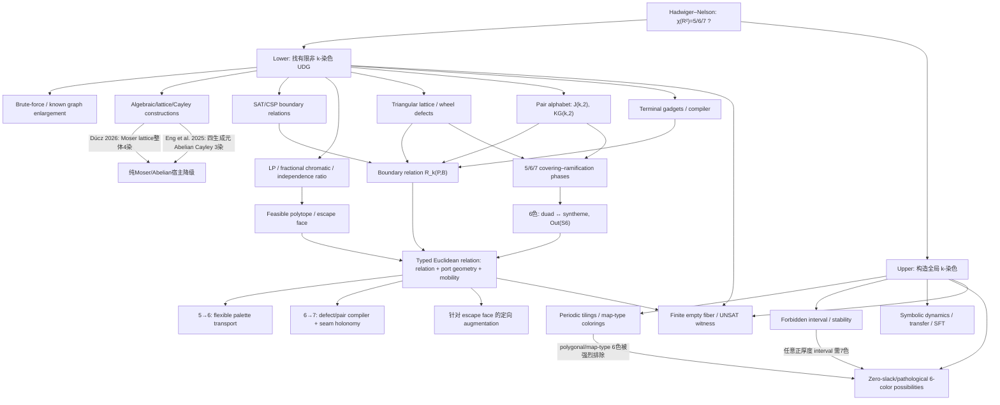

# Hadwiger–Nelson 项目完整研究脉络、统一框架与未来路线图
## 版本：2026-09-08 · 研究参考文档（非规范、非必须遵守）

> **用途**  
> 本文是一份“从零上手到项目最前沿”的完整研究 handoff。目标读者可以完全不了解 Hadwiger–Nelson 问题，也可以是刚接手项目的新 agent。  
> 它刻意保留：历史分叉、失败路线、条件性构造、计算实验、跨领域类比、未完成猜想和未来计划。  
> **本文是参考地图，不是协议、不是证明论文、不是必须遵守的研究计划。**
>
> **重要真实性说明**  
> 1. “公开文献事实”与“项目内结果”严格区分。  
> 2. 当前公开状态截至 2026-09-08 仍是
>    \[
>    5\le \chi(\mathbb R^2)\le 7.
>    \]
>    本项目尚未证明 \(\chi(\mathbb R^2)=5,6,\) 或 \(7\)。  
> 3. 历史项目文档曾记录 R4 certificate、flower、seven-orbit conditional module 等计算结果；本轮运行环境未重新取得原始 Markdown 全文和 verifier，因此本文保留其**研究意义与历史角色**，但将其标为“待重放/待复核”，不把它们冒充新近独立核验的定理。  
> 4. 本文中的若干新统一——尤其是 \(S_6\) duad–syntheme 对偶与六色 defect 的联系——目前属于**有精确组合学支撑的研究方向**，不是 Hadwiger–Nelson 的已完成证明。

---

# 0. 一页总览：我们到底在做什么？

Hadwiger–Nelson 问题问：

> 能否给欧氏平面 \(\mathbb R^2\) 的每一个点染色，使任意两个距离恰好为 \(1\) 的点颜色不同？最少需要多少种颜色？

把整个平面看成一个无限图：

\[
\mathcal U=(\mathbb R^2,E),\qquad
xy\in E\iff |x-y|=1.
\]

问题就是求

\[
\chi(\mathcal U)=\chi(\mathbb R^2).
\]

截至 2026-09-08：

\[
\boxed{5\le\chi(\mathbb R^2)\le7.}
\]

下界 \(5\) 来自有限的五色单位距离图；上界 \(7\) 来自经典周期平面染色。真正未知的是：

\[
\boxed{\chi(\mathbb R^2)=5,\ 6,\ \text{还是 }7?}
\]

本项目最初沿许多彼此独立的路线发散：

- 直接寻找更高色的有限单位距离图；
- 扩大已知晶格、Moser lattice、Cayley 图；
- 利用代数坐标、Gram 矩阵、Galois/数域；
- SAT / CSP / 边界状态枚举；
- LP、fractional chromatic、independence ratio；
- 三角格局部结构、wheel defect；
- pair-state / Johnson–Kneser 图；
- upper bound 的 tiling、map coloring、forbidden interval；
- symbolic dynamics、transfer matrix、holonomy；
- sheaf / contextuality / cohomology；
- graph homomorphism / covering；
- rigidity / linkage / \(\exists\mathbb R\)；
- 群论，特别是 \(S_6\) 外自同构。

经过多轮排除和统一，现在主线已经明显收缩为：

\[
\boxed{
\text{typed Euclidean relation compiler}
+
\text{escape-face cutting}
+
\text{5/6/7 defect–covering phases}
}
\]

其中最值得押注的两个具体突破口是：

\[
\boxed{\text{5→6：Euclidean palette transport / flexible pair bus}}
\]

和

\[
\boxed{\text{6→7：duad–syntheme defect compiler + seam/holonomy}}
\]

核心直觉只有一句：

> **抽象颜色逻辑其实很容易制造强约束，真正困难的是二维单位距离几何能否把这些颜色信息稳定、可复制、可转弯地传过去。**

---

# 1. 问题背景：为什么一个“染色题”会这么难？

## 1.1 单位距离图语言

任何有限点集 \(P\subset\mathbb R^2\) 都定义有限单位距离图

\[
U(P)=(P,E_P),\qquad
xy\in E_P\iff |x-y|=1.
\]

若找到

\[
\chi(U(P))\ge k,
\]

就立即得到

\[
\chi(\mathbb R^2)\ge k.
\]

由于 de Bruijn–Erdős 紧致性定理，对有限颜色数而言：

> 若整个无限图不能 \(k\)-染色，则一定已经存在某个有限子图不能 \(k\)-染色。

因此若真有

\[
\chi(\mathbb R^2)\ge6
\]

或

\[
\chi(\mathbb R^2)\ge7,
\]

原则上一定存在一个有限 certificate。

这就是为什么 lower-bound 路线天然适合：

- 构造；
- SAT；
- proof certificate；
- 有限状态；
- gadget；
- exact algebraic verification。

而 upper bound 不一样。要证明 \(\chi\le6\)，需要真正给整个平面一个全局一致的六染色；它可能非常非局部、非周期、甚至没有任何常规正则性。

---

## 1.2 公开历史的几个关键节点

### 早期：\(4\le\chi\le7\)

Moser spindle 是七顶点、4-chromatic 的经典单位距离图，因此很长时间只有

\[
4\le\chi(\mathbb R^2)\le7.
\]

经典 \(7\)-color upper bound 可以用小六边形周期染色理解：让每个颜色单元直径小于 \(1\)，同时让同色单元之间隔得足够远。

### 2018：de Grey 突破到 \(5\)

Aubrey de Grey 构造有限 5-chromatic unit-distance graph，使下界从 4 升到 5。

随后 Exoo–Ismailescu 给出另一种构造；Heule、Parts 等持续压缩规模。

### 当前最小已知 5-chromatic 例子

Jaan Parts 得到 509 顶点的 5-chromatic UDG；截至 2026 年仍是最小已知顶点数纪录。

这说明一个很重要的事实：

> 五色性可以隐藏在一个相当大的有限几何系统中；它未必由一个极小、肉眼可见的单一局部禁形解释。

### 2026：Haugland 的 Moser-spindle-free 构造

Haugland 构造 2131 顶点、无 Moser spindle 的 5-chromatic UDG。这个结果本身不提高 \(5\le\chi\)，但方法对本项目非常重要：先构造一个**terminal relation**，再通过等距复制和组合得到不可四染的整体。

这直接支持了我们的 relation/gadget 思路。

---

# 2. 一个新 agent 应该先建立的三个直觉

## 2.1 这个问题不是“找一个奇怪图”这么简单

如果只把目标设成：

> 多加点、多加边，看看什么时候 SAT 变 UNSAT。

搜索空间几乎没有结构。

真正需要的是知道：

- 某个局部模块向外暴露什么颜色信息；
- 它允许哪些 boundary states；
- 新增模块究竟删除了哪些逃逸状态；
- 两个模块怎样组合；
- 颜色逻辑上的组合在二维几何上是否真的可实现。

---

## 2.2 “抽象图论能做到”远不等于“平面单位距离图能做到”

例如我们下面会证明：

\[
Q\vee(2K_2)
\]

在抽象 \(k\)-coloring 中是一个极其简单的 perfect pair copier，只要

\[
\chi(Q)=k-2.
\]

但在二维单位距离几何中，真正实现这种 join 极其困难。

所以整个问题可以被看成：

\[
\boxed{
\text{逻辑可表达性}
\quad\cap\quad
\text{Euclidean realizability}
}
\]

的交集问题。

---

## 2.3 三角格为什么总是出现？

因为三角格是单位距离约束最致密、最均匀、最容易形成有限 quotient 的基础结构之一。

它一方面提供强局部约束；另一方面又太有对称性，以至于颜色 defect 很容易周期性流走。

因此：

> 三角格是最好的“校准平台”，但很可能不是最终 obstruction 本身。

我们后来对 5/6/7 三相的理解正是从这里长出来的。

---

# 3. 研究路线总图

下面这张图不是时间顺序，而是“现在回头看”所有路线之间的关系。



---

# 4. 第一阶段：直接 lower-bound 构造与已知图路线

## 4.1 为什么一开始自然会搜大图？

因为 de Bruijn–Erdős 告诉我们：

\[
\chi(\mathbb R^2)>k
\]

一定能由有限图见证。

所以最直接的方法就是：

1. 选一个代数坐标池；
2. 生成所有单位距离边；
3. SAT 测试 \(k\)-colorability；
4. 若 SAT，扩点；
5. 若 UNSAT，抽 proof core/minimal core。

这是完全合理的。

问题是，纯 brute force 的信息利用率极低。

一个 SAT 结果只告诉你“还有至少一种逃法”，却没有告诉你：

- 逃法属于哪类；
- 哪个局部区域承载了自由度；
- 怎样一次性切掉整类逃法。

于是项目逐步转向“分析 boundary state space”。

---

## 4.2 已知五色图给我们的真正启示

de Grey、Heule、Parts 的历史说明：

- 单位距离五色 obstruction 可以非常复杂；
- 大量对称复制和组合确实有效；
- SAT / DRAT / exact verification 可以成为数学证明的一部分；
- 但仅仅压点数不一定直接揭示 \(5\to6\) 的机制。

Parts 的 human-verifiable proof 又提醒我们：

> 一个大的计算构造可以在适当重组后变成可理解的逻辑链，而不是永远停留在黑箱 SAT。

这对本项目的目标很重要：最终如果真的找到 6-chromatic finite UDG，最好同时追求：

\[
\text{small relation basis}
+
\text{machine certificate}
+
\text{human structural explanation}.
\]

---

# 5. 第二阶段：代数坐标、Moser lattice、Cayley 与“漂亮宿主”路线

## 5.1 最初直觉

一个自然想法是：

> 已知五色图坐标高度代数化，那么是否存在一个足够丰富的数域、环、格点群或 Cayley 宿主，里面自然包含越来越强的单位距离约束？

于是关注过：

- Eisenstein / triangular lattice；
- Moser lattice；
- 加法群产生的单位向量；
- algebraic number coordinates；
- Galois conjugation；
- Gram matrices；
- 距离多项式；
- orbit closure；
- algebraic symmetry reduction。

这些工具本身都非常有用。

---

## 5.2 为什么“一个巨大、均匀、漂亮的 Abelian 宿主”逐渐被降级？

外部进展给了两个非常明确的警告。

### Dúcz 2026：整个 Moser lattice 有 geometric 4-coloring

MRVZ 的 27 点图把 geometric fractional chromatic number 推到 \(4\)，一度让 Moser lattice 看起来很有希望。

但 Dúcz 后来证明：

> 整个 Moser lattice 都有 geometric 4-coloring，而且延伸到 Moser ring。

因此如果搜索被限制在这个宿主里，就不可能仅靠继续加这个格子里的点制造真正的 integral \(5\to6\) 突破。

### Eng–Harris–Krebs–Meeks–Schmidt 2025

他们证明：任取四个平面单位向量，由其正负生成的相应 Abelian Cayley graph 总是 3-colorable；更一般地，他们给出相当强的四生成元 Abelian Cayley 图结果。

这进一步说明：

\[
\boxed{
\text{高均匀性 + Abelian translation symmetry}
}
\]

经常不是制造高色 obstruction 的朋友，反而会给出低色 quotient。

---

## 5.3 这条路线没有失败，而是换了角色

代数工具现在更适合做：

### 1. exact coordinate compiler

把数值发现转成严格代数坐标。

### 2. unit-distance verification

证明某些边真的恰好长 \(1\)。

### 3. symmetry/orbit compression

减少 SAT 和 relation table 的状态数。

### 4. seam construction

不是构造一个无限均匀宿主，而是精确焊接两个本来不兼容的局部晶格/模块。

### 5. reducibility detector

判断候选图是否其实落在一个已知低色 Abelian quotient 中。

因此：

\[
\boxed{
\text{代数从“主宿主”退到“精确焊接与证明基础设施”。}
}
\]

---

# 6. 第三阶段：LP、fractional chromatic、independence ratio 与“先看可行域”

## 6.1 为什么 fractional 路线重要？

普通 \(k\)-colorability 是离散的，容易出现：

- SAT 状态空间很大；
- 一个点加入后完全看不出作用；
- 搜索没有梯度。

fractional chromatic / independence ratio / LP 则给了连续“压力值”。

MRVZ 证明：

\[
\chi_f(\mathbb R^2)\ge4.
\]

其核心使用 geometric fractional chromatic number 和一个 27 顶点 UDG。

---

## 6.2 2026 Dúcz–Varga 的突破为什么对本项目尤其重要？

Dúcz–Varga 解决 Erdős 关于 finite UDG independence ratio 是否能低于 \(1/4\) 的问题。

关键方法不是“继续巨大随机扩图”，而是：

> 在一个已经精确处于阈值 \(4\) 的 27 点系统上，加入**精心挑选的两个点**，使 geometric fractional chromatic number 严格超过 \(4\)。

这给我们非常强的方法论：

\[
\boxed{
\text{先完整理解 feasible face，再设计最小 augmentation 去切整个 face。}
}
\]

这与项目内后来对 R4 / flower / conditional module 的理解高度一致。

---

# 7. 第四阶段：从“整图色数”转到 boundary relation

这是项目最重要的概念转向之一。

## 7.1 基本定义

给定有限点集 \(P\)，取 boundary/ports

\[
B\subseteq P.
\]

定义

\[
R_k(P,B)
=
\operatorname{proj}_B
\operatorname{Hom}(U(P),K_k).
\]

意思是：

> 枚举整个 gadget 的所有合法 \(k\)-染色，只保留边界 \(B\) 上出现的颜色模式。

这样一个图不再只被评价为：

- “能不能 \(k\)-染？”

而是被评价为：

- “它允许边界怎样染？”
- “它排除了什么 relation？”
- “它可以作为哪个逻辑 gate？”

---

## 7.2 为什么这比只看 \(\chi(G)\) 强很多？

一个仍然 5-colorable 的图也可能是极强 gadget。

例如它可能强迫：

\[
c(a)=c(b),
\]

或

\[
c(a)\neq c(b),
\]

或“两个端口边使用相同的一对颜色”。

这些 relation 可以组合，最终形成矛盾。

Haugland 2026 的构造就是非常现实的外部例子：先建立特定 terminal relation，再通过多个等距副本组合成五色 obstruction。

---

# 8. 项目内早期局部构造：flower、R4、seven-orbit conditional module

> **状态标记：历史项目内结果，当前环境待重新载入原始 verifier。**

当前会话能可靠恢复的是它们在路线中的**角色**，而不是所有精确点坐标/子句/hash。

## 8.1 flower：树状局部一致不等于环状全局一致

flower 类结构最重要的认识不是“这个图差一点不可染”。

它揭示：

\[
\boxed{
\text{acyclic/local consistency}
\not\Rightarrow
\text{cyclic/global consistency}.
}
\]

在树状扩展中，局部颜色选择可以一层层继续；

但当多个路径重新闭合时，会出现额外兼容条件。

这把研究推向：

- overlap；
- cycle constraints；
- holonomy；
- joint obstruction。

---

## 8.2 R4：低阶 marginal 不足以代表真实 global section

历史项目记录中，R4 certificate 被用来刻画某类局部/边界可行结构。

它真正带来的思想是：

\[
\boxed{
\text{若只保存低阶 marginal，
可能保留大量实际上不能同时实现的伪状态。}
}
\]

因此不能只统计：

- 单点颜色频率；
- 两点 pair frequency；
- 每个小模块分别可行。

必须研究：

\[
\text{joint boundary relation}.
\]

这也是后来“escape face”概念的前身。

---

## 8.3 seven-orbit conditional module：我们已经会制造 bad fiber，但不会保证 activation

历史记录里出现过一个七轨道条件模块：

> 在某些 boundary/orbit 条件激活时，内部会进入很强甚至矛盾的状态。

但没有证明任意 global coloring 都必须触发那个条件。

这类构造的失败模式统一写成：

\[
\boxed{
\text{conditional contradiction}
\neq
\text{unconditional contradiction}.
}
\]

所以真正缺的是：

\[
\boxed{\text{activation theorem}}
\]

即证明所有逃逸状态都必须落入我们会杀掉的那个 fiber。

---

# 9. “escape face”语言：把 SAT 失败转成几何目标

设一个 core gadget 的边界状态集合是

\[
R\subseteq\Omega.
\]

新增一个模块相当于加入另一个约束

\[
C\subseteq\Omega.
\]

新的边界状态变成：

\[
R\cap C.
\]

若仍 SAT，真正应该问的不是：

> “为什么还没 UNSAT？”

而是：

> “剩下来的 \(R\cap C\) 到底长什么样？”

如果把 coloring states 做成：

- 0/1 incidence vectors；
- orbit-count vectors；
- marginal vectors；

那么可行状态常常落在一个 polytope 或有限 union of faces 上。

于是下一步搜索应当瞄准：

\[
\boxed{\text{entire escape face}}
\]

而不是瞄准一个随机 satisfying assignment。

这是 Dúcz–Varga 式“精确两点 augmentation”最值得借鉴的地方。

---

# 10. 第五阶段：pair alphabet —— 从点颜色升级到边状态

## 10.1 基本定义

若 \(uv\) 是单位边，则在 proper \(k\)-coloring 中

\[
c(u)\neq c(v).
\]

因此这条边天然携带一个无序二色状态：

\[
\lambda(uv)=\{c(u),c(v)\}
\in \binom{[k]}2.
\]

这就是 **pair alphabet**。

状态数：

\[
\left|\binom{[k]}2\right|=\frac{k(k-1)}2.
\]

特别地：

- \(k=5\)：10 个 pair states；
- \(k=6\)：15 个 pair states；
- \(k=7\)：21 个 pair states。

---

## 10.2 Johnson 与 Kneser 两个自然关系

在 \(\binom{[k]}2\) 上有两个最自然关系。

### intersection-one

\[
I(T,U)\iff |T\cap U|=1.
\]

对应 Johnson graph：

\[
J(k,2)=L(K_k).
\]

### disjointness

\[
D(T,U)\iff T\cap U=\varnothing.
\]

对应 Kneser graph：

\[
KG(k,2).
\]

五色情况：

\[
KG(5,2)\cong \text{Petersen graph}.
\]

因此项目里早期出现的 Petersen-like 结构并不是偶然：

> 五色 pair logic 的“互不相交”关系本来就是 Petersen graph。

这是一个非常自然的抽象，不需要人为发明。

---

# 11. 一个项目内已可直接证明的小定理：抽象 pair copier 极其简单

## 11.1 定理

令

\[
\chi(Q)=k-2.
\]

构造 join

\[
G=Q\vee(2K_2),
\]

其中两条 \(K_2\) 是两个 pair ports。

那么在任意 proper \(k\)-coloring 中，两条端口边使用**相同的二色 palette**。

## 11.2 证明

由于每条端口边的两个点都与 \(Q\) 中所有顶点相邻，所以端口颜色不能出现在 \(Q\) 中。

而端口边本身需要两个不同颜色，所以 \(Q\) 最多使用 \(k-2\) 种颜色。

另一方面：

\[
\chi(Q)=k-2,
\]

故 \(Q\) 恰好使用 \(k-2\) 色。

总 palette 还剩恰好两色。

两条端口边都只能使用这两色。

故：

\[
\boxed{
\lambda(e_1)=\lambda(e_2).
}
\]

证毕。

---

## 11.3 五色情况为何如此刺眼？

取

\[
Q=K_3.
\]

于是抽象 pair copier 只需要：

\[
K_3\vee(2K_2).
\]

颜色逻辑简单得几乎不能更简单。

但在二维单位距离几何里，要让一个端口点同时距离等边三角形三个顶点都为 \(1\)，做不到。

单位边长等边三角形外接圆半径：

\[
R=\frac1{\sqrt3}\neq1.
\]

所以这里第一次非常清楚地看到：

\[
\boxed{
\text{逻辑瓶颈几乎不存在；
真正瓶颈是 Euclidean join realizability。}
}
\]

这成为当前主线的重要转折。

---

# 12. 为什么普通 \(R_k(P,B)\) 还不够：必须加入几何端口类型

## 12.1 逻辑可组合，不代表几何可组合

在普通 CSP 中，如果两个 relation 有共同变量，直接识别变量即可。

但单位距离 gadget 有空间姿态。

如果 boundary 是一条完整单位边：

- 位置固定后；
- 长度固定；
- 方向也被输入边固定；
- 输出 gadget 通常只剩离散的镜像选择。

因此一条“逻辑导线”未必能：

- 转弯；
- fan-out；
- 绕开别的模块；
- 以任意相位接到下一个 gate。

---

## 12.2 新母对象：typed Euclidean relation

因此把

\[
R_k(P,B)
\]

升级为类似

\[
\mathfrak R_k(P,B)
=
\Big(
\text{boundary metric type},
\text{color relation},
\text{realization/mobility data},
\text{symmetry}
\Big).
\]

至少应保存：

1. boundary 点的距离矩阵；
2. 哪些 boundary 点/边被视作 ports；
3. 固定输入端后，输出端还有多少连续自由度；
4. Euclidean stabilizer；
5. 镜像/旋转分支；
6. color relation；
7. composition 时是否会引入额外单位距离边；
8. exact realizability certificate。

我们把这类对象暂称：

\[
\boxed{\textbf{typed Euclidean relation compiler}}
\]

或更抽象地：

\[
\boxed{\textbf{fibered Euclidean relation operad}}.
\]

---

## 12.3 新的评价指标：information × mobility

以前一个 gadget 的评分可能只看：

\[
|R_k(P,B)|.
\]

允许状态越少，约束越强。

现在更合理的是同时看：

- information pressure；
- geometric mobility。

例如可以定义启发式量：

\[
I=\log |\Omega_B|-\log |R_k(P,B)|
\]

以及固定输入后输出 realization space 的维数 \(m\)。

真正值得搜索的不是单纯最大 \(I\)，而是某种：

\[
\boxed{
\text{score}=F(I,m,\text{fanout},\text{rigidity},\text{size}).
}
\]

这就是目前所谓的：

\[
\boxed{\textbf{information–mobility tradeoff}}.
\]

---

# 13. 第六阶段：wheel defect —— 原来它就是 pair-state collision

考虑三角格中的一个中心 \(o\) 和六个单位邻点 \(v_1,\dots,v_6\)。

六条 radial edges 携带 pair states：

\[
T_i=\{c(o),c(v_i)\}.
\]

由于都包含中心颜色 \(c(o)\)，这些 pair states 全部落在 Johnson 图中对应颜色 \(c(o)\) 的一个 star：

\[
S_{c(o)}
=
\{\{c(o),a\}:a\neq c(o)\}.
\]

这个 star 只有

\[
k-1
\]

个状态。

但 wheel 有 6 条 radial edges。

于是最少发生

\[
6-(k-1)=7-k
\]

次重复。

若定义 defect 为最小“重复超额”，便得到：

\[
\boxed{D_{\min}=7-k.}
\]

所以：

- \(k=7\)：0 defect；
- \(k=6\)：至少 1 defect；
- \(k=5\)：至少 2 defects。

这不再只是 pigeonhole 小观察，而是：

\[
\boxed{
\text{wheel defect}
=
\text{Johnson-star 中的 pair collision}.
}
\]

因此：

\[
\boxed{
\text{pair route 与 defect route 本来就是同一语言。}
}
\]

---

# 14. 5/6/7 三相：从“缺陷计数”升级为 covering / ramification

三角格写成

\[
T=\mathbb Z^2
\]

并令邻接差向量为

\[
\pm(1,0),\quad
\pm(0,1),\quad
\pm(1,-1).
\]

考虑 affine coloring：

\[
c(m,n)=m+rn\pmod k.
\]

我们得到三个极其自然的 calibration phases。

---

## 14.1 七色相：零缺陷 / unramified covering

取

\[
c_7(m,n)=m+3n\pmod7.
\]

六个邻接颜色差为：

\[
\pm1,\quad \pm3,\quad \pm2.
\]

模 7 正好是：

\[
\{1,2,3,4,5,6\}.
\]

因此每个点的六个邻点恰好看到其余六种颜色各一次。

所以映射

\[
T\to K_7
\]

是 locally bijective graph homomorphism，即 graph covering。

这意味着：

\[
\boxed{
7\text{ 色三角格相是无分歧 covering phase。}
}
\]

其 kernel 是指数 7 子格；有限 quotient 给出 \(K_7\) 的经典环面三角嵌入，并与 Heawood 型环面结构相连。

直觉：

> 七色不是“颜色很多所以宽松”，而是在三角格局部度数 \(6\) 与 \(K_7\) 每点邻居数 \(6\) 之间达到完美局部匹配。

---

## 14.2 六色相：一个 defect / perfect matching phase

取

\[
c_6(m,n)=m+3n\pmod6.
\]

六个邻接差为：

\[
1,5,3,3,2,4.
\]

所以每个顶点看到其他五种颜色都至少一次，其中“相差 3”的颜色出现两次。

对颜色集合 \(\{0,\dots,5\}\)，额外重复关系形成 perfect matching：

\[
P=
\{\{0,3\},\{1,4\},\{2,5\}\}.
\]

相应 quotient multigraph 的邻接矩阵可写成：

\[
\boxed{
B_6=J-I+P.
}
\]

其中 \(P\) 代表额外重复的一条 matching edge。

因此六色 minimal-defect phase 可以理解为：

\[
\boxed{
K_6 \text{ local surjection}
+
\text{一个 perfect-matching ramification}.
}
\]

---

## 14.3 五色相：两个 defect / 5-cycle phase

取

\[
c_5(m,n)=m+2n\pmod5.
\]

邻接差：

\[
1,4,2,3,4,1.
\]

于是相差 \(\pm1\) 的两种邻色各重复一次。

额外重复关系在五个颜色上形成一个 5-cycle：

\[
C_5.
\]

quotient multigraph：

\[
\boxed{
B_5=J-I+A(C_5).
}
\]

所以：

\[
\boxed{
5\text{ 色相}
=
K_5 \text{ 上两次局部分歧，按 }C_5\text{ 组织。}
}
\]

---

## 14.4 三相统一表

| 相 | affine coloring | 最小 defect | finite quotient / local form | 直觉 |
|---|---|---:|---|---|
| 7 | \(m+3n\pmod7\) | 0 | \(K_7\) covering | 无分歧 |
| 6 | \(m+3n\pmod6\) | 1 | \(J-I+P\) | perfect matching 分歧 |
| 5 | \(m+2n\pmod5\) | 2 | \(J-I+A(C_5)\) | cycle 型分歧 |

这给项目一个非常统一的语言：

\[
\boxed{
5\to6\to7
=
\text{ramification 逐步消失。}
}
\]

---

# 15. 为什么这三个具体例子“特殊”？

项目一直强调：不要只记例子，要问为什么例子特殊。

这三个 coloring 特殊，不只是因为公式漂亮。

它们都是：

\[
\boxed{\text{perfect/role colorings with tiny finite quotients}.}
\]

也就是说：

- 每种颜色看到别的颜色的局部统计完全由颜色本身决定；
- 无穷三角格压成有限 quotient；
- defect 不再是随机局部事故，而是有限状态动力学。

这解释了三角格为何既有用又危险：

> 它太容易形成小 quotient，因此 defect 可以周期性、无摩擦地传播；这恰好解释为什么“继续加更多同方向三角格”通常不会产生最终矛盾。

因此真正需要的是：

\[
\boxed{\text{off-lattice / cross-direction seam}}
\]

去破坏这个 finite quotient。

---

# 16. 六色为什么可能是整个问题最特殊的一相：\(S_6\) 外自同构

这是当前最值得继续研究、但尚未转化成 HN 证明的一条新支脉。

## 16.1 duads

六色 pair states：

\[
\binom{[6]}2
\]

共有

\[
15
\]

个。

经典组合学称每个二元子集为一个 **duad**。

---

## 16.2 synthemes

把 6 个颜色分成 3 个不相交的 pair：

\[
\{\{a,b\},\{c,d\},\{e,f\}\}.
\]

这种 perfect matching 叫 **syntheme**。

六个点的 perfect matchings 也恰好有：

\[
15
\]

个。

而在

\[
KG(6,2)
\]

中，一个 syntheme 正是三个两两不相交 duads 形成的 3-clique。

---

## 16.3 这与六色 defect 有什么关系？

六色 perfect minimal-defect phase 给每个颜色一个“重复伙伴”。

若这种伙伴关系在局部区域内稳定一致，就形成一个 perfect matching：

\[
P.
\]

也就是一个 syntheme。

因此：

- 单位边传的是 duad；
- balanced 六色 defect phase 传的是 syntheme。

二者都是 15 状态。

---

## 16.4 为什么 \(S_6\) 恰好有异常外自同构？

经典 Sylvester 结构：

- 15 duads；
- 15 synthemes；
- 6 pentads / synthematic totals。

\(S_6\) 是唯一拥有非平凡 outer automorphism 的对称群。

其经典组合模型恰恰通过 duad–syntheme–pentad 结构构造。

相关 incidence geometry 是 Cremona–Richmond configuration；其 Levi graph 与 Tutte–Coxeter graph 相连。

因此一个非常诱人的可能性出现：

\[
\boxed{
\text{6-color pair information}
\longleftrightarrow
\text{6-color defect matching information}
}
\]

也许能通过 \(S_6\) 的异常对偶被统一。

---

## 16.5 必须避免的过度结论

现在不能说：

> “\(S_6\) 外自同构解释了 Hadwiger–Nelson。”

我们目前只有：

1. pair alphabet 确实是 15 duads；
2. perfect six-color defect phase 确实自然给 syntheme；
3. 二者的 \(S_6\) 作用确实处于经典 outer automorphism 组合几何中；
4. 尚未证明任意 hypothetical 6-coloring 都被迫进入这种 syntheme phase；
5. 尚未找到一个 Euclidean seam，其 relation 在 outer twist 后直接变成矛盾。

所以当前正确研究问题是：

\[
\boxed{
\textbf{Duad–Syntheme Reduction Problem}
}
\]

> 能否用有限 overlapping wheels / seams，把任意六染色局部压入一个由 15 synthemes 控制的 minimal-defect phase？

若可以，再问：

> outer automorphism 是否把复杂 defect transition 变成简单 pair relation？

---

# 17. 六色 pair-CSP 的一个非常有用的小定理：disjointness 足以定义 equality

设

\[
T,U\in\binom{[6]}2.
\]

定义：

\[
D(T,U)\iff T\cap U=\varnothing.
\]

那么：

\[
\boxed{
T=U
}
\]

当且仅当存在 pair states \(X,Y\)，满足

\[
D(T,X),\ D(U,X),
\]

\[
D(T,Y),\ D(U,Y),
\]

以及

\[
D(X,Y).
\]

## 证明

### 若 \(T=U\)

补集有 4 个颜色。

可以把这 4 个颜色分成两个 disjoint pairs：

\[
X,\ Y.
\]

于是条件成立。

### 若 \(|T\cap U|=1\)

则

\[
|T\cup U|=3.
\]

外面只剩 3 个颜色，不可能容纳两个互不相交的二元集 \(X,Y\)。

### 若 \(T\cap U=\varnothing\)

外面只剩 2 个颜色，因此只有唯一一个 pair 同时与 \(T,U\) disjoint，不可能再找到彼此 disjoint 的两个 witness。

故成立。

---

## 17.1 研究意义

这说明在抽象 six-color pair logic 中：

\[
\boxed{
D\Rightarrow =
}
\]

所以 pair compiler 不必同时独立搜索：

- equality gate；
- disjointness gate。

若能几何实现一个足够可组合的 \(D\)-gadget，抽象 equality 可以通过有限 composition 得到。

真正剩下的问题再次是：

\[
\boxed{\text{fan-out 与 Euclidean routing}.}
\]

---

# 18. 五色 pair-CSP 也有类似简化

对

\[
T,U\in\binom{[5]}2
\]

定义：

\[
D(T,X)\iff T\cap X=\varnothing,
\]

\[
I(X,Y)\iff |X\cap Y|=1.
\]

则有：

\[
\boxed{
T=U
\iff
\exists X,Y:
D(T,X)\land D(U,X)\land
D(T,Y)\land D(U,Y)\land
I(X,Y).
}
\]

因为：

- 若 \(T=U\)，补集有 3 色，可取两个不同的 2-subsets，它们交一个颜色；
- 若 \(T,U\) 只交一个颜色，公共补集只有 2 色，只剩唯一公共 disjoint pair；
- 若 \(T,U\) disjoint，公共补集只有 1 色，没有任何 pair。

因此五色 equality 也不是抽象逻辑难题。

而

\[
KG(5,2)\cong\text{Petersen graph}
\]

意味着整个五色 pair 逻辑有一个非常经典的小有限模型。

---

# 19. 当前真正的五色核心问题：Euclidean Palette Transport

把上面所有简化叠在一起，五色最值得问的已经不再是：

> 能不能抽象定义 pair equality？

答案基本是能。

真正的问题是：

\[
\boxed{
\textbf{Euclidean Palette Transport Problem}
}
\]

能否构造一个纯 unit-distance planar gadget，使：

\[
\lambda(e_{\rm in})=\lambda(e_{\rm out}),
\]

并且具备至少一种非平凡几何 mobility：

- 输出端可转动；
- 输出端可沿连续族移动；
- 可以 fan-out；
- 可以绕开障碍；
- 或者有足够多离散姿态形成长程 circuit。

理想对象不是“rigid pair copier”，而是：

\[
\boxed{\textbf{flexible palette bus}.}
\]

如果这种东西存在，它可能是 5→6 路线的“晶体管”。

---

# 20. 为什么 rigidity/linkage/\(\exists\mathbb R\) 现在变得相关？

平面 unit-distance graph realization 的识别问题是 \(\exists\mathbb R\)-complete；unit-length linkage realizability 也具有非常高的表达能力。

这告诉我们：

> “所有杆长度都必须为 1”并不意味着几何机械能力贫乏。

因此可以尝试把两个原本分开的领域拼起来：

\[
\text{graph coloring gadget}
+
\text{unit linkage mechanism}.
\]

目标：

- 颜色 relation 保持不变；
- 几何输出却能运动。

这正好对应 information–mobility tradeoff。

需要注意：

- \(\exists\mathbb R\)-universality 只说明几何 realization space 可以复杂；
- 它完全没有自动保证颜色 relation；
- 所以不能把 universality 当作 copier 存在证明。

但它强烈说明这条路值得探索。

---

# 21. Upper bound 路线：为什么越来越像“零裕度奇异相”

## 21.1 经典 periodic / polygonal 方案受到强限制

如果六染色存在，一个最自然的猜法是某种：

- periodic tiling；
- polygonal map coloring；
- finitely many local cell types。

但 Sokolov–Voronov 的 map-type 结果强烈限制了这类方案：相当广的规则 map coloring，特别是 proper polygonal coloring，需要至少 7 色。

因此：

\[
\boxed{
\text{若 Euclidean 6-coloring 存在，它很可能不是普通 polygon tiling。}
}
\]

---

## 21.2 forbidden interval 结果更尖锐

Voronov 证明：

对任意

\[
\varepsilon>0,
\]

若禁止所有距离

\[
[1-\varepsilon,1+\varepsilon],
\]

就至少需要 7 色。

所以一个 hypothetical exact-distance 6-coloring 必须利用一个非常脆弱的性质：

> 它只需要避开“恰好 1”，不能避开任何正厚度的邻域。

直觉上：

\[
1\notin D_{\rm mono}
\]

但非常可能有：

\[
1\in\overline{D_{\rm mono}}.
\]

也就是同色距离可以无限逼近 1，却永远不等于 1。

我们把它叫：

\[
\boxed{\textbf{zero-slack phase}.}
\]

---

## 21.3 Minkowski 邻近世界为什么值得看？

Gehér 对正偶边形单位球的 Minkowski plane 给出了直到 regular 22-gon 情况的简单 6-coloring。

这说明：

- “接近 Euclidean”的某些非欧度量里，六色确实存在；
- 但 Euclidean 圆形极限可能发生临界跃迁。

所以可研究：

\[
\text{polygon norm}
\to
\text{circle norm}
\]

过程中六色结构如何失效。

这更像一个 phase transition / zero-slack 极限问题，而不是普通连续扰动。

---

# 22. 上下界真正的统一：同一个 restriction–extension system

考虑所有有限点集上的 coloring spaces：

\[
\mathcal C_k(P)
=
\operatorname{Hom}(U(P),K_k).
\]

若

\[
P\subseteq Q,
\]

有 restriction：

\[
\rho_{Q,P}:\mathcal C_k(Q)\to\mathcal C_k(P).
\]

于是所有有限 coloring 构成一个巨大 inverse/projective system。

---

## 22.1 Lower bound 是什么？

证明

\[
\chi(\mathbb R^2)>k
\]

就是找到有限 \(P\)：

\[
\mathcal C_k(P)=\varnothing.
\]

也就是：

\[
\boxed{\text{找到一个 empty finite fiber。}}
\]

---

## 22.2 Upper bound 是什么？

证明

\[
\chi(\mathbb R^2)\le k
\]

就是找到一个全局 coherent family：

\[
c_P\in\mathcal C_k(P)
\]

且所有 inclusion 下相容。

也就是：

\[
\boxed{\text{找到一个 global coherent section。}}
\]

---

## 22.3 为什么这比“SAT vs construction”更统一？

因为每一次 upper extension failure 都可能给出 lower gadget。

例如：

- 某类 boundary state 可以延伸很多层；
- 到某个 seam 第一次无法延伸；
- 那个最小 failure neighborhood 就是一个候选 obstruction。

因此理想工作流是：

\[
\boxed{
\text{upper continuation}
\longrightarrow
\text{first obstruction}
\longrightarrow
\text{lower gadget}.
}
\]

上下界不必分别做两套完全不同的数学。

---

# 23. symbolic dynamics / SFT / transfer matrix 支脉

如果把平面离散化到一个周期点集或三角格扩展上，颜色约束可以看作有限型符号系统：

\[
\text{SFT}.
\]

局部窗口是 allowed patterns，扩大窗口等于做 extension。

这给我们：

- transfer matrix；
- finite automata；
- entropy；
- periodic points；
- forbidden patterns；
- phase classification。

但它的局限也很明确：

> 原始 HN 的点集不是固定 lattice；真正关键的 off-lattice unit edges 可能完全不在一个给定 SFT 里。

因此 symbolic dynamics 更适合：

1. 分类三角格内的 5/6/7 phases；
2. 研究 defect propagation；
3. 找 periodic escape families；
4. 再用 off-lattice seam 打破它们。

---

# 24. holonomy / monodromy 支脉

假设一个 pair/defect 状态可以沿模块链传播。

每跨过一个 gadget，状态发生一个变换：

\[
T\mapsto \phi_i(T).
\]

沿闭环：

\[
T\mapsto
\phi_n\cdots\phi_1(T).
\]

若闭环几何上回到同一端口，但：

\[
\phi_n\cdots\phi_1
\]

没有允许的 fixed point，就得到矛盾。

这就是：

\[
\boxed{\text{color holonomy obstruction}.}
\]

它与：

- graph covering；
- monodromy；
- gauge theory；
- cocycles；
- defect transport；

都有天然类比。

目前这仍是**框架语言**，尚未有完整 HN holonomy certificate。

---

# 25. sheaf / contextuality / cohomology 支脉

另一种抽象是：

- 每个局部 patch 有 coloring sections；
- patch overlap 上必须相容；
- 问所有局部 sections 是否能 glue 成 global section。

这与 sheaf-theoretic contextuality 很接近。

flower/R4 类失败可以被解释为：

\[
\text{局部 section 存在}
\]

但：

\[
\text{不存在全局 glue}.
\]

这条路线的价值主要在：

- 给 obstruction 分层；
- 定义“局部一致层级”；
- 解释为什么 pairwise/marginal consistency 不够。

但目前不建议把全部工作直接翻译成高阶上同调，原因是：

> 如果不能给出可计算、可搜索、可落地到具体 UDG 的 cocycle/certificate，那么抽象会比问题本身更重。

因此它是解释和设计语言，不是当前第一计算主线。

---

# 26. universal algebra / CSP 支脉

pair relations 本质上是有限 relation structure。

例如状态域：

\[
A_k=\binom{[k]}2.
\]

可以研究：

- pp-definability；
- polymorphisms；
- relational clones；
- CSP complexity；
- primitive-positive gadgets。

重要直觉：

> 抽象颜色 CSP 的逻辑表达能力其实很强；很多 equality/copy/disjointness relation 在有限逻辑层可以由很小的公式定义。

因此真正要问的是：

\[
\boxed{
\text{哪些 pp-definable relations
还能被二维 unit-distance geometry 实现？}
}
\]

这就是“逻辑 clone”与“Euclidean realizable clone”的差。

这是 typed relation compiler 的理论背景之一。

---

# 27. graph homomorphism / covering / role coloring 支脉

5/6/7 三相之所以自然，和 locally surjective / locally bijective homomorphism 非常接近。

七色三角格：

\[
T\to K_7
\]

是 locally bijective covering。

六色 perfect phase：

\[
T\to K_6
\]

是 locally surjective，但有恰好一个局部 multiplicity defect。

五色：

局部 multiplicity 更大。

因此可以把三相视作：

\[
\boxed{
\text{covering}
\to
\text{branched covering}
\to
\text{more strongly ramified covering}.
}
\]

未来值得系统检索：

- perfect colorings of triangular grid；
- equitable partitions；
- role colorings；
- locally surjective homomorphisms；
- finite quotient classification。

---

# 28. statistical mechanics 支脉：defects、dimers、frustration

六色 minimal defect 看起来像一个 dimer/perfect matching 变量。

这给出统计力学类比：

- perfect phase；
- defect excitation；
- domain wall；
- dimer covering；
- frustration；
- seam energy；
- phase transition。

这个类比的价值不在“套物理术语”，而在于提醒我们：

> 不要逐点追颜色，应该追 defect degrees of freedom。

特别是若局部颜色自由度被 quotient 后只剩：

\[
15\text{ 个 syntheme states},
\]

那么研究对象就从巨大 coloring space 变成一个有限 defect model。

---

# 29. 信息论支脉：information–mobility tradeoff

一个端口传的信息量可以粗略量化为：

\[
\log_2 |\text{state alphabet}|.
\]

例如：

- 单点端口：\(\log_2 k\)；
- pair port：\(\log_2\binom{k}{2}\)；
- syntheme port（六色 perfect defect）：\(\log_2 15\)。

但端口几何越大，往往越 rigid。

于是有一个类似通信系统的 tradeoff：

\[
\boxed{
\text{更多逻辑信息}
\Longleftrightarrow
\text{更少几何自由度}.
}
\]

最终突破可能需要找到一个“编码”：

> 用多个低信息、高 mobility 的小端口，组合传递一个高信息 pair/syntheme state。

这也是为什么“单点 relay + 内部 encoding”可能比“整条单位边硬复制”更值得搜索。

---

# 30. 代数几何 / 数论 / Galois 支脉

这些方向在早期发散中被认真考虑过。

目前最合理的定位：

## 30.1 algebraic realization spaces

单位距离条件：

\[
(x_i-x_j)^2+(y_i-y_j)^2=1
\]

本身定义实代数簇/半代数集。

gadget mobility 可以通过：

- dimension；
- irreducible components；
- singularities；

来研究。

## 30.2 exact algebraic coordinates

最终任何候选 finite UDG 都需要避免“浮点近似等于 1”的伪边。

适合用：

- number fields；
- minimal polynomials；
- exact radicals；
- Gröbner/resultant（必要时）；
- certified interval arithmetic。

## 30.3 Galois conjugation

若一个坐标构造在数域中，Galois 共轭可能：

- 产生另一 realization；
- 暴露隐藏对称；
- 证明某些距离不可等于 1；
- 检查 candidate seam 是否本质上仍属于旧低色宿主。

但目前没有证据表明纯 Galois route 可以直接决定 \(5/6/7\)。

---

# 31. Gram / SDP / spectral 支脉

可以把点配置写成 Gram matrix：

\[
G_{ij}=\langle x_i,x_j\rangle.
\]

单位距离条件等价于：

\[
G_{ii}+G_{jj}-2G_{ij}=1.
\]

同时平面 realization 要求：

\[
G\succeq0,\qquad \operatorname{rank}G\le2.
\]

这使问题与：

- SDP；
- Euclidean distance matrices；
- rigidity；
- rank constraints；

相连。

谱方法、Lovász theta、fractional relaxations也可提供：

- lower-bound pressure；
- independent-set bounds；
- 候选模块筛选。

但已有经验表明：

> relaxations 很擅长告诉我们“哪里接近临界”，却未必自动给 integral 6-chromatic obstruction。

因此它们目前主要服务于：

\[
\boxed{\text{escape-face detection / candidate scoring}.}
\]

---

# 32. 为什么“纯三角格扩展”被降级？

这是项目中一个重要负结论。

三角格有太整齐的：

\[
5,\ 6,\ 7
\]

finite quotient colorings。

所以只沿同一 triangular-lattice direction 增大 patch，很容易只是逼近一个已有周期 phase。

其结果通常是：

- SAT 一直存在；
- defect 排布越来越规整；
- 没有真正 frustration。

因此现在原则是：

\[
\boxed{
\text{triangular lattice 用来分类状态；
off-lattice seam 用来杀状态。}
}
\]

---

# 33. 为什么“更多同类局部约束”也被降级？

flower/R4 经验表明：

> 如果 surviving assignments 都共享一个低维 escape mechanism，那么重复加入同型约束只会把它们排列得更整齐，不会消灭。

所以一个新 augmentation 的价值不在边数，而在：

\[
\boxed{
\text{它是否切 transversal direction？}
}
\]

也就是是否攻击原可行面的真正自由方向。

---

# 34. 为什么当前 lower 比 upper 更像可完成的主线？

## Lower

若

\[
\chi\ge6,
\]

有限 witness 必然存在。

目标明确：

\[
\exists P:\mathcal C_5(P)=\varnothing.
\]

而计算、SAT、exact verification 都有成熟基础设施。

## Upper

若

\[
\chi=6,
\]

则现有外部结果暗示这个 coloring 可能：

- 非 polygonal；
- 非普通 map-type；
- 不能有任何正 forbidden-distance slack；
- 可能极端不规则。

所以直接构造六染色目前更加神秘。

因此项目现阶段的优先级是：

\[
\boxed{
\text{Lower 主攻，Upper 作为 state-classification 与 obstruction generator。}
}
\]

---

# 35. 当前主线 A：typed Euclidean relation engine

这是基础设施主线。

对于每个 candidate gadget，记录：

```text
Gadget
├── exact point coordinates / algebraic representation
├── unit-distance edge certificate
├── boundary ports
├── boundary metric type
├── color relation modulo S_k
├── orbit decomposition
├── realization branches
├── fixed-input residual mobility
├── fan-out compatibility
├── mirror/rotation actions
├── composition collisions
└── SAT / UNSAT / proof certificate
```

目标不是做一个“数据库”，而是建立真正可搜索的：

\[
\boxed{\text{Euclidean relation algebra}.}
\]

---

# 36. 当前主线 B：5→6 flexible palette transport

优先搜索目标：

\[
\lambda(e_{\rm in})=\lambda(e_{\rm out})
\]

但要求输出端不是完全 rigid。

候选策略：

### B1. linkage-based flexible copier

先找 unit linkage 有连续运动，再叠加 coloring blocker。

### B2. single-point articulation relay

避免直接把整条 edge 作为所有 gate 的共同刚性边。

### B3. encoded pair state

不直接传一条 pair edge，而用多个小端口编码同一个 pair。

### B4. approximate join simulation

不试图实现 \(K_3\vee 2K_2\) 的真实 join，而是用多个中介 relation 模拟“端口颜色不得落入 blocker palette”。

### B5. disjointness/intersection primitive

先找更容易几何实现的 pair relation，再通过有限 CSP composition 得到 equality。

---

# 37. 当前主线 C：6→7 duad–syntheme compiler

分成四步。

## C1. 分类 minimal six-color triangular phases

证明或实验判断：

> 在足够大的 overlap 区域里，若每个 wheel 都保持最小一个 defect，那么局部 defect partner 是否必然组织成 perfect matching \(P\)？

若是，状态数压成：

\[
15\text{ synthemes}.
\]

## C2. 建立 syntheme transition table

对两个重叠 wheel/patch：

\[
S\to S'
\]

枚举所有可实现转换。

## C3. outer twist

选定一个 \(S_6\) outer automorphism / duad–syntheme incidence identification，把 transition relation 重新写成 duad language。

观察它是否变成：

- equality；
- disjointness；
- Johnson adjacency；
- permutation；
- 小 affine relation。

## C4. cross-direction seam / holonomy

加入一个不属于原 triangular quotient 的单位距离 seam。

目标是得到：

\[
S\mapsto\phi(S)
\]

并在闭环中：

\[
\Phi(S)\neq S
\]

对所有状态成立。

这将产生有限 6-color contradiction。

---

# 38. 当前主线 D：escape-face cutting

这条主线直接继承 R4/flower/conditional module 与 Dúcz–Varga 的方法论。

流程：

1. 选一个当前最强但仍 SAT 的 core；
2. 完整枚举 boundary relation；
3. 除以颜色置换和几何对称；
4. 计算 surviving orbit types；
5. 若可行，构造其 convex/marginal polytope；
6. 找 extreme escape archetypes；
7. 枚举候选新点/新 seam；
8. 对每个候选，不看“增加多少边”，而看：
   \[
   \text{删除了多少 escape orbits/faces};
   \]
9. 优先寻找同时切掉整面的一小组点；
10. 得到 UNSAT 后抽 proof core。

核心原则：

\[
\boxed{
\text{search over states, not over vertices.}
}
\]

---

# 39. 当前主线 E：upper continuation 反向制造 lower gadgets

即使我们主要押 lower，也应该持续尝试“构造 hypothetical 6-coloring”。

但目的改成：

> 不一定真把整个平面染完，而是看它第一次在哪里必须做非自然选择。

具体：

1. 从 triangular/minimal-defect phase 出发；
2. 扩加入新方向；
3. 每一步保留全部 boundary phases；
4. 找到第一次无法保持 phase 的 seam；
5. 提取最小 failure patch；
6. 作为 lower gadget 输入主线 D。

因此 upper 与 lower 形成循环：

\[
\boxed{
\text{attempt global extension}
\to
\text{local failure}
\to
\text{finite obstruction search}.
}
\]

---

# 40. 一个更成熟的“四色定理式”目标结构

四色定理最终不是无穷地试地图，而是：

\[
\text{unavoidable set}
+
\text{reducibility}.
\]

HN 可能需要类似结构：

## 假设存在六染色

每个 wheel 至少有一个 defect。

## Unavoidable theorem

证明足够大的某类单位距离 patch 必然出现若干有限 defect configurations 之一。

## Reducibility theorem

证明这些 configurations 每一个都不能跨某个 seam 延伸。

于是矛盾。

即：

\[
\boxed{
\text{6-coloring}
\Rightarrow
\text{unavoidable finite phase}
\Rightarrow
\text{reducible}
\Rightarrow\bot.
}
\]

这可能是最终计算机辅助证明的自然形态。

---

# 41. “联合障碍”为什么比“单个神奇 gadget”更现实？

历史经验不断说明：

- 单个局部 gadget 很难直接杀死所有 coloring；
- 但多个弱 relation 可以联合形成闭环矛盾。

因此我们不再执着于：

> 找一个 20 点小图直接六色。

更现实的是构造：

\[
G_1,\dots,G_m
\]

每个都只实现简单 relation，最后 composition：

\[
R(G_1)\circ\cdots\circ R(G_m)=\varnothing.
\]

这和：

- 电路；
- CSP；
- proof by gadgets；
- Haugland terminal construction；

非常一致。

---

# 42. 已完成 / 部分完成 / 未完成实验清单

## 42.1 当前会话可直接重新推导的数学事实

### [A] 抽象 pair copier theorem

\[
Q\vee(2K_2),\ \chi(Q)=k-2
\]

强迫两端口 pair palette 相等。

**状态：已证明。**

### [B] wheel defect = pair-state collision

\[
D_{\min}=7-k.
\]

**状态：已证明。**

### [C] 三角格 5/6/7 affine phase

\[
c_7=m+3n\pmod7,
\]

\[
c_6=m+3n\pmod6,
\]

\[
c_5=m+2n\pmod5.
\]

以及相应：

\[
K_7,\quad J-I+P,\quad J-I+A(C_5).
\]

**状态：已直接验证。**

### [D] six-color pair disjointness 定义 equality

**状态：已证明。**

### [E] five-color \(D+I\) 定义 equality

**状态：已证明。**

### [F] six-color duads/synthemes 均为 15 状态，syntheme 是 perfect matching

**状态：经典组合学事实。**

### [G] 与 \(S_6\) outer automorphism 的组合结构对应

**状态：经典群论事实。**

### [H] “它会导出 HN 6→7 obstruction”

**状态：未证明，核心研究假设。**

---

## 42.2 历史项目记录存在、但当前环境应重跑 verifier 的内容

- R4 certificate；
- flower 系列局部一致/闭环实验；
- seven-orbit conditional module；
- 若干 boundary relation tables；
- orbit-reduced SAT 枚举；
- 之前构造的具体几何点集与 exact certificate。

**推荐动作：**
恢复原始文件后先做一次“研究状态审计”：

1. 重算所有单位距离；
2. 重跑 SAT；
3. 重跑 proof checker；
4. 记录 exact commit/hash；
5. 将“观察”与“定理”分离。

---

## 42.3 尚未完成的关键实验

### [P1] typed relation 数据结构

未系统实现。

### [P2] flexible pair copier / palette bus

未找到。

### [P3] six-color disjointness Euclidean gadget

未找到。

### [P4] minimal six-color phase 的有限分类

未完成。

### [P5] 任意六染色强迫进入 syntheme phase

完全未证明。

### [P6] outer-twist 后的真实 seam relation table

未完成。

### [P7] nontrivial holonomy cycle

未找到。

### [P8] R4/flower escape-face 的系统 polyhedral closeout

历史上有部分工作，但未形成最终 closure theorem。

### [P9] exact six-color upper construction

没有。

### [P10] finite 6-chromatic Euclidean UDG

没有。

---

# 43. 当前应明确降级的路线

## 43.1 纯 Moser lattice 扩张

外部已知整体 geometric 4-coloring。

**结论：不作为 integral 5→6 主宿主。**

---

## 43.2 纯四生成元 Abelian Cayley

外部有强 3-colorability 定理。

**结论：不作为高色主宿主。**

---

## 43.3 只加更大的同向三角格 patch

存在低复杂度周期 5/6/7 phases。

**结论：只用于状态分类，不再期待靠面积增长自动 UNSAT。**

---

## 43.4 只看 pairwise marginal

R4/flower 教训：低阶 consistency 可能保留伪 global states。

**结论：必须保存 joint boundary relation。**

---

## 43.5 随机增点 + 只记录 SAT/UNSAT

无法学到 escape geometry。

**结论：改成 targeted face cutting。**

---

## 43.6 假定 upper coloring 有连续/可测/多边形规则性

原问题没有这种假设。

外部结果越强，越说明若 6-coloring 存在可能非常病态。

**结论：任何 regularity assumption 都只能作为条件性子问题。**

---

# 44. 仍值得保留但非主线的发散方向

## 44.1 Fourier / harmonic analysis

与 1-avoiding sets、density、fractional chromatic 有深联系。

适合：

- continuous relaxation；
- density obstruction；
- candidate frequency detection。

暂不直接期待给 integral \(\chi\ge6\)。

---

## 44.2 additive combinatorics

单位距离方向集和 difference sets 可以用加法语言研究。

尤其适合分析：

- periodic/Bohr-type coloring；
- Abelian quotient；
- 为什么均匀结构易低染。

---

## 44.3 Ramsey / Euclidean Ramsey theory

可研究某些有限配置是否在颜色类中不可避免。

可能产生：

\[
\text{unavoidable configuration}
\]

部分，但离“配置中恰好出现 unit monochromatic pair”仍有距离。

---

## 44.4 model theory / compactness

de Bruijn–Erdős 已经给出基础 compactness。

更高阶模型论语言可能用于：

- definability；
- ultraproduct；
- local-to-global。

目前没有明显比有限 CSP 更直接的收益。

---

## 44.5 proof complexity

一旦出现 UNSAT candidate，应研究：

- DRAT/LRAT；
- resolution width；
- symmetry breaking；
- minimal unsat core。

最终可能得到“计算机辅助但可审计”的正式证明。

---

## 44.6 formalization

Lean/Coq 等形式化对于最终结果极有价值。

已有公开项目在形式化五色 lower bound。

若我们找到新 certificate，应设计：

\[
\text{exact coordinates}
+
\text{edge verification}
+
\text{SAT proof}
\]

三层独立核验。

---

# 45. 567 三相的更大哲学图景

可以把颜色数量看成“局部自由度相”。

## 7 相

局部六邻域可以一一对应六个其他颜色：

\[
\text{完全无缺陷}.
\]

关键词：

- covering；
- flat；
- zero curvature；
- periodic quotient；
- no collision。

## 6 相

必须发生恰一个 collision。

关键词：

- minimal ramification；
- dimer；
- perfect matching；
- syntheme；
- middle phase；
- exceptional \(S_6\)。

## 5 相

至少两个 collision。

关键词：

- stronger branching；
- 5-cycle quotient；
- Petersen/Kneser pair geometry；
- palette transport。

因此 5/6/7 不是三个互不相干的答案候选，而是：

\[
\boxed{
\text{同一个局部 covering 系统的三个 ramification regimes。}
}
\]

---

# 46. 为什么六色可能是“临界相”而不只是中间整数？

有三个独立迹象都把 6 指向一个特殊临界位置。

### 1. 三角格局部度数是 6

七色时刚好可以 locally bijective。

六色时刚好只缺一个邻居颜色槽，产生一个最小 collision。

### 2. defect 恰好变成 perfect matching

不是任意复杂对象，而是 syntheme。

### 3. \(S_6\) 是唯一有异常 outer automorphism 的 \(S_n\)

这使 pair duads 与 matching synthemes 有一个独一无二的组合对偶。

这些都不能当证明，但共同说明：

\[
\boxed{
\chi=6\text{ 这个候选值在结构上确实非常特殊。}
}
\]

---

# 47. 对“5、6、7 哪个更像真答案”的当前内部判断

这不是概率定理，只是研究资源配置判断。

## 为什么不能因为下界多年停在 5 就押 5？

历史上 HN 的下界从 4 到 5 就停了几十年，直到 2018 才突破。

“没找到 6-chromatic finite graph”不能强证 \(\chi=5\)。

## 为什么不能因为 regular upper 都失败就直接押 7？

原问题允许极端非规则 coloring。

forbidden interval / polygonal map 的 7-color 结果只说明：

> 六色若存在，必须非常脆弱。

并不排除 exact-distance pathological 6-coloring。

## 为什么项目现阶段最适合攻击 6→7？

因为 six-color local defect 有最干净的有限状态候选：

\[
15\text{ synthemes}.
\]

若这个 reduction 成功，6→7 可能第一次变成真正可计算 finite-state problem。

## 为什么 5→6 仍然必须并行？

因为如果 pair transport 被突破，finite 6-chromatic witness 可能直接出现。

所以当前不是“只做一个答案”，而是：

\[
\boxed{
5\to6\text{ 研究信息传输，}
\qquad
6\to7\text{ 研究 defect duality。}
}
\]

---

# 48. 下一阶段最优先的研究序列

这里写成逻辑依赖，而不是必须遵守的排期。

## Stage 0：恢复真实性基础

- 找回全部历史 Markdown；
- 恢复 R4/flower/seven-orbit 原始数据；
- 重跑 verifier；
- 建立 result ledger。

输出：

```text
THEOREM
COMPUTATIONAL-CERTIFICATE
EXPERIMENT
HEURISTIC
DEAD-END
OPEN
```

六种标签。

---

## Stage 1：建立 typed relation engine

先支持：

- 单点；
- 单位边；
- 两边端口；
- wheel；
- triangular patch。

自动输出：

- \(R_k\)；
- quotient by \(S_k\)；
- port geometry；
- mobility；
- composition candidates。

---

## Stage 2：重做所有“小例子”

把：

- Moser spindle；
- triangle；
- triangular 5/6/7 phases；
- known terminal gadgets；

全部放进统一框架。

目的不是发现新结果，而是验证语言正确。

---

## Stage 3：五色 flexible palette bus 搜索

搜索空间优先级：

1. articulation gadgets；
2. unit linkages with one degree of freedom；
3. small pair relations \(D,I\)；
4. encoded pair transport；
5. multi-stage copier。

---

## Stage 4：六色 phase classification

枚举逐渐增大的 triangular patches：

- 保留 minimal defect；
- quotient by color permutation；
- 检查是否最终只剩 syntheme phases；
- 寻找 domain walls 和 non-perfect phases。

真正重要的不是“看到 syntheme 很多”，而是：

\[
\boxed{
\text{证明/证否 syntheme reduction。}
}
\]

---

## Stage 5：cross-direction seam

从一个已知六色 perfect phase 出发，加单位距离方向。

对每个 seam 枚举 transition：

\[
R_{\rm seam}\subseteq
\mathcal S\times\mathcal S,
\]

其中

\[
|\mathcal S|=15.
\]

---

## Stage 6：outer automorphism transform

对 transition relation 做 duad–syntheme twist。

自动检查是否接近：

- equality；
- complement；
- disjointness；
- Johnson adjacency；
- permutation graph；
- small association scheme relation。

---

## Stage 7：闭环 compiler

寻找 seam sequence：

\[
R_1\circ R_2\circ\cdots\circ R_m
\]

使 diagonal 消失：

\[
R_{\rm loop}\cap\{(S,S)\}=\varnothing.
\]

若成功，即得到 holonomy contradiction candidate。

---

## Stage 8：exact geometry + proof extraction

- 精确代数坐标；
- unit edge certificate；
- chromatic SAT；
- DRAT/LRAT；
- symmetry-independent verifier；
- 人类结构说明。

---

# 49. 如果 syntheme reduction 失败怎么办？

这是必须提前规划的分支。

假设存在 minimal six-color states 不形成 global perfect matching。

那么不要把它当路线失败。

它反而意味着存在：

\[
\boxed{\text{syntheme domain wall / defect excitation}.}
\]

下一步研究：

1. domain wall 能否无限延伸？
2. 是否有守恒量？
3. 是否必然产生 defect density？
4. 两条 wall 是否必须相交？
5. wall 与 off-lattice unit edge 是否冲突？

也就是说：

\[
\text{完美相}
\]

和

\[
\text{domain-wall 相}
\]

都可以成为 unavoidable-set 分类的一部分。

---

# 50. 如果 flexible pair bus 不存在怎么办？

同样不应该无穷盲搜。

应尝试证明一个 negative theorem：

> 某类端口类型下，不可能存在具有非零 mobility 的 perfect pair copier。

若能证明，就说明必须改变编码。

可能替代方案：

- 三点端口；
- 多边形 phase port；
- probabilistic/relational transport，不要求 deterministic equality；
- syntheme-level transport；
- one-time-use gate 而非 reusable wire；
- 直接用几何闭环，不需要长程 wire。

因此“找不到 copier”也可以转化成结构定理。

---

# 51. 一个可能的统一“母猜想”

目前可以提出一个研究性母猜想，不作为项目结论：

> **Euclidean Information Bottleneck Conjecture（非正式）**  
> Hadwiger–Nelson 的 5/6/7 不确定性，本质上等价于二维单位距离 gadget 在有限颜色关系上的可传输信息容量：  
> - 5 色 pair 信息是否足以被可组合地复制决定 \(5\to6\)；  
> - 6 色 defect/pair 双重信息是否能形成非平凡 holonomy 决定 \(6\to7\)。

如果这个观点成立，最终问题可能从：

\[
\text{“给整个平面染色”}
\]

转成：

\[
\boxed{
\text{“分类有限 Euclidean relation semigroup/category”。}
}
\]

这是当前最宏观的统一愿景。

---

# 52. 外部结果如何改变了我们的路线

## de Grey / Exoo–Ismailescu / Heule / Parts

告诉我们：

- finite obstruction 路线真实有效；
- SAT + exact geometry 是成熟工具；
- 高色可以来自复杂组合模块。

## Haugland 2026

告诉我们：

- terminal relation + isometric composition 可以实际产出强 UDG；
- relation compiler 不是空泛抽象。

## MRVZ

告诉我们：

- geometric fractional constraints 是很强的“压力测量器”；
- Euclidean group amenability / geometric symmetry 可进入 coloring analysis。

## Dúcz 2026

告诉我们：

- Moser lattice 作为主宿主存在整体低色结构；
- 搜索若被困在一个漂亮格子里，可能永远碰不到 integral obstruction。

## Dúcz–Varga 2026

告诉我们：

- “先找到临界 feasible face，再加极少数定向点”可以真正解决长期开放问题。

## Eng et al. 2025

告诉我们：

- Abelian Cayley 世界的低色机制比想象中更强；
- symmetry 不是越多越好。

## Voronov

告诉我们：

- 任何 forbidden-distance 正厚度都会把问题推到 7；
- exact distance 的 6 色若存在必然零裕度。

## Sokolov–Voronov

告诉我们：

- polygonal / broad map-type upper constructions 已受到强排除。

## Gehér

告诉我们：

- 邻近 Minkowski 世界确实可以有简单 6-color phases；
- Euclidean 极限可能是真正临界点。

## \(S_6\) 经典群论

提供：

- duad；
- syntheme；
- pentad；
- outer automorphism；
- Cremona–Richmond；
- Tutte–Coxeter；

这套语言恰好和六色 pair/defect 状态数对上。

---

# 53. 推荐外部资料索引

以下按“对本项目的用途”排序，不要求全部先读。

## [E1] Aubrey de Grey
**The chromatic number of the plane is at least 5**  
arXiv:1804.02385

用途：2018 下界突破原始构造。

## [E2] Geoffrey Exoo, Dan Ismailescu
**The chromatic number of the plane is at least 5 – a new proof**  
arXiv:1805.00157

用途：另一套五色 lower construction。

## [E3] Jaan Parts
**The chromatic number of the plane is at least 5 — a human-verifiable proof**  
arXiv:2010.12661

以及 Parts 的 graph minimization 工作（509 顶点相关）。

用途：有限 certificate、人类可验证组织方式、最小已知五色 UDG。

## [E4] Jan Kristian Haugland
**A Moser-spindle-free 5-chromatic unit distance graph on 2131 vertices in the plane**  
arXiv:2608.04542

用途：terminal relation + 几何组合；非常贴近当前 gadget 主线。

## [E5] Máté Matolcsi, Imre Z. Ruzsa, Dániel Varga, Pál Zsámboki
**The fractional chromatic number of the plane is at least 4**  
arXiv:2311.10069

用途：geometric fractional chromatic、27 点临界结构、Euclidean symmetry。

## [E6] Ákos Dúcz
**A note on geometric colorings of the Moser lattice**  
arXiv:2606.12325

用途：Moser lattice 整体 geometric 4-coloring；解释为何纯宿主扩张会饱和。

## [E7] Ákos Dúcz, Dániel Varga
**A unit-distance graph in the plane with independence ratio below 1/4**  
arXiv:2606.28157

用途：两点定向 augmentation；escape-face cutting 的现实成功范式。

## [E8] Katherine Eng, Timothy Harris, Mike Krebs, Mason Meeks, Claudia Maria Schmidt
**Four plane unit vectors generate a 3-colorable graph**  
arXiv:2511.10813

用途：Abelian Cayley 低色结构；排除“多几个均匀单位方向自然就高色”的直觉。

## [E9] Vsevolod Voronov
**The chromatic number of the plane with an interval of forbidden distances is at least 7**  
arXiv:2304.10163

用途：zero-slack 六色直觉。

## [E10] Georgy Sokolov, Vsevolod Voronov
**On the chromatic number of the plane for map-type colorings**  
arXiv:2502.01958

用途：排除大类 regular/map/polygonal 六色 upper。

## [E11] Panna Gehér
**Note on the chromatic number of Minkowski planes: the regular polygon case**  
arXiv:2301.13695

用途：Minkowski 六色邻近模型、Euclidean 临界极限。

## [E12] Marcus Schaefer
**Realizability of Graphs and Linkages**

用途：unit-distance recognition / unit linkage 与 \(\exists\mathbb R\)；支持几何 mobility 路线。

## [E13] Aaron Landesman / Ravi Vakil / Peter Cameron 等关于 \(S_6\) outer automorphism 的讲义

关键词：

- duads；
- synthemes；
- pentads；
- Cremona–Richmond；
- Tutte–Coxeter。

用途：六色 defect/pair 双重语言。

---

# 54. 新 agent 的建议阅读顺序

如果完全没有背景：

## 第一轮：只理解问题和外部状态

读：

1. Hadwiger–Nelson 定义；
2. Moser spindle；
3. de Grey；
4. Parts；
5. 七色 upper。

先明白：

\[
5\le\chi\le7.
\]

---

## 第二轮：理解项目为何不再 brute force

读：

1. Moser lattice 4-color；
2. four-vector Abelian Cayley 3-color；
3. Dúcz–Varga 两点 augmentation；
4. Haugland terminal relation。

此时应建立：

\[
\text{“需要 relation，不只是大图。”}
\]

---

## 第三轮：理解项目内部统一语言

依次掌握：

1. \(R_k(P,B)\)；
2. escape face；
3. pair alphabet；
4. wheel defect；
5. typed Euclidean relation；
6. information–mobility tradeoff。

---

## 第四轮：理解 567 三相

手算：

\[
c_7=m+3n\pmod7,
\]

\[
c_6=m+3n\pmod6,
\]

\[
c_5=m+2n\pmod5.
\]

一定要自己列出六个邻接差。

不应该只相信本文。

---

## 第五轮：进入当前最前沿

研究：

1. six-color syntheme reduction；
2. \(S_6\) outer automorphism；
3. Euclidean pair/disjointness gadget；
4. flexible port mobility；
5. seam transition；
6. holonomy。

---

# 55. 新 agent 接手时不应该做什么

不要：

- 因为某个旧 Markdown 写“proved”就直接引用为正式定理；
- 因为浮点距离接近 1 就加边；
- 只扩大一个 lattice patch；
- 只报告 SAT/UNSAT，不保存 boundary relation；
- 把 regular coloring 的不可能性当成原问题 upper 的不可能性；
- 把 \(S_6\) 漂亮对应当成证明；
- 在没有 exact certificate 时宣布 6-chromatic UDG；
- 为了“统一”而强行把所有支脉翻译成范畴论/上同调。

应该：

- 小例子先手算；
- 几何与颜色逻辑分层；
- 每次失败都提取 escape mechanism；
- 每次成功都找更成熟的定理解释；
- 对外部结果优先看原论文；
- 所有 computational claims 可重放。

---

# 56. 一个推荐的项目 truth ledger

以后每个结果都建议加标签。

### THEOREM-EXTERNAL
公开论文已证明。

### THEOREM-INTERNAL
项目内有完整可复核证明。

### CERTIFIED-COMPUTATION
有 exact input + verifier + proof certificate。

### EXPERIMENT
运行得到，但尚未形成 proof certificate。

### HEURISTIC
结构直觉/猜想。

### DEPRECATED
已经被外部定理或内部反例降级的路线。

例如：

```text
[THEOREM-INTERNAL]
Abstract pair copier Q ∨ 2K2.

[THEOREM-INTERNAL]
Wheel pair collision D_min = 7-k.

[HEURISTIC]
Every sufficiently coherent minimal 6-color triangular phase reduces to a syntheme.

[EXPERIMENT / NEEDS-REPLAY]
Historical R4 certificate.

[DEPRECATED AS MAIN HOST]
Pure Moser-lattice enlargement.
```

---

# 57. 当前项目“最短版核心逻辑”

如果必须压成十行：

1. HN 仍是 \(5,6,7\) 三选一。
2. finite lower witness 原则上一定存在，若真实答案 \(>5\)。
3. 纯 lattice/Abelian 宿主太容易低染，已被外部结果强烈降级。
4. 应研究 gadget 的 boundary relation，而不只看整图色数。
5. pair state \(\binom{[k]}2\) 是天然中间语言。
6. wheel defect 正是 Johnson-star 中 pair collision。
7. 三角格 7/6/5 对应 covering / 一重 matching ramification / 两重 cycle ramification。
8. 六色 defect matching 与 15 synthemes、六色 pair 与 15 duads 精确对上 \(S_6\) exceptional geometry。
9. 抽象 copy/equality 很容易；真正难点是二维 Euclidean routing 与 mobility。
10. 当前主线是 flexible palette transport + syntheme reduction + seam holonomy + escape-face cutting。

---

# 58. 最终大白话直觉

如果完全不用专业术语：

想象每个单位距离边不只是“两个点不能同色”，它还像一根线，携带“这两个点用了哪两种颜色”的信息。

在普通逻辑电路里，我们很容易复制这条信息、转弯、分叉。

但在真实平面上，一根单位边的位置和方向一旦定了，接在它上面的几何零件也几乎被钉死了。

所以这个问题最怪的地方可能根本不是“颜色太多”。

而是：

> **颜色逻辑想做一件事，欧氏几何不让你把线接过去。**

三角格则走向另一个极端：

> 它太规则，颜色信息可以形成漂亮的周期 covering，一直绕过去，不会自己爆炸。

所以最终需要的对象大概既不能太 rigid，也不能太 symmetric。

我们要找的是一种真正的单位距离“晶体管”：

\[
\boxed{
\text{逻辑上能强迫颜色关系，}
\quad
\text{几何上又仍然能传输和组合。}
}
\]

五色世界里，它最自然地表现成 pair/palette transport。

六色世界里，局部最小 defect 又奇妙地变成 perfect matching；而六个颜色的 pair 和 matching 分别是 \(S_6\) 经典的 duads 与 synthemes。

所以现在最诱人的统一画面是：

\[
\boxed{
\begin{array}{ccc}
5\to6 &:& \text{传播 pair palette}\\[2mm]
6\to7 &:& \text{把 defect matching 与 pair state 对偶后传播}\\
\end{array}
}
\]

最后用一个不兼容的几何闭环把信息送回原处：

\[
\text{state}
\longrightarrow
\text{transport}
\longrightarrow
\text{twist}
\longrightarrow
\text{return}
\neq
\text{state}.
\]

如果能真正把这个闭环做成有限 unit-distance graph，就会得到 lower-bound certificate。

---

# 59. 当前项目结论

截至本文版本：

\[
\boxed{
\text{原始 Hadwiger–Nelson 问题未解决。}
}
\]

但项目已经从大量彼此松散的路线，收缩出一个较清楚的中心：

\[
\boxed{
\textbf{有限颜色关系的 Euclidean 可实现与可传输性}
}
\]

以及三个互相咬合的主方向：

\[
\boxed{
\begin{aligned}
&\textbf{A. typed Euclidean relation compiler},\\
&\textbf{B. escape-face targeted augmentation},\\
&\textbf{C. 5/6/7 covering–defect phases，尤其 six-color duad–syntheme duality}.
\end{aligned}
}
\]

其中目前最关键的未解子问题可以明确写成：

### 5→6
\[
\boxed{
\text{是否存在具有足够 mobility 的 Euclidean palette transport gadget？}
}
\]

### 6→7
\[
\boxed{
\text{是否能把任意六染色压成有限 syntheme defect states，并由 seam 产生无 fixed-point holonomy？}
}
\]

### 统一
\[
\boxed{
\text{二维单位距离几何到底允许传输多少颜色信息？}
}
\]

这可能才是我们一路从大图、晶格、SAT、LP、defect、pair alphabet、covering、\(S_6\) 走到现在以后，真正逐渐显露出来的“母问题”。

---

# 60. 附录：项目路线状态表

| 路线 | 历史作用 | 当前判断 | 下一步 |
|---|---|---|---|
| 已知五色 UDG / brute force | 证明 finite obstruction 可行 | 保留基础设施，不单独盲搜 | relation-aware search |
| Moser lattice | algebraic rich host | 主宿主降级 | exact coordinates / calibration |
| Abelian Cayley | 统一方向向量 | 主宿主降级 | 识别低色 quotient |
| triangular lattice | 强局部约束 | 核心 calibration | phase/defect classification |
| SAT | 检测 integral feasibility | 核心工具 | 保存完整 boundary relation |
| LP/fractional | 连续压力与可行面 | 强辅助主线 | escape-face cutting |
| flower/R4 | 暴露 local/global gap | 保留、待复核 | joint relation / face analysis |
| seven-orbit conditional | bad fiber | activation 未完成 | 找 unavoidable activation |
| pair alphabet | 边级颜色信息 | 当前核心 | \(D,I,=\) Euclidean gadgets |
| Petersen/Kneser | 五色 pair disjointness | 自然有限模型 | 编译几何关系 |
| wheel defect | 5/6/7 局部 collision | 当前核心 | 与 pair/syntheme 统一 |
| graph covering | 解释 7/6/5 quotient | 当前核心解释语言 | branched phase classification |
| \(S_6\) outer automorphism | six-color duality | 高优先新支脉 | outer-twisted seam tables |
| linkage/\(\exists\mathbb R\) | 几何 mobility | 高潜力 | flexible palette bus |
| symbolic dynamics | lattice extension | 辅助主线 | finite-state phase |
| sheaf/cohomology | local-to-global obstruction | 解释性 | 有计算对象时再升格 |
| upper periodic tiling | 直接 6-color 尝试 | 受到强限制 | 不假设 regularity |
| forbidden interval | 测 upper 稳定性 | 强外部约束 | zero-slack analysis |
| Minkowski polygon norms | 邻近 6-color 世界 | 重要比较 | Euclidean critical limit |
| formal proof | 最终可信度 | 必须准备 | exact edge + SAT certificate |

---

# 61. 文档维护建议

本文未来更新时，最好不要直接覆盖“失败路线”。

每条路线保留：

- 为什么当时合理；
- 做过什么；
- 得到什么反例/外部定理；
- 为什么降级；
- 哪一部分仍可复用。

因为 Hadwiger–Nelson 这种问题中，今天失败的结构可能在新抽象下重新成为关键。

同样，任何新漂亮联系——包括 \(S_6\)——都应保持两层描述：

1. **精确已证事实是什么；**
2. **我们猜它为什么可能重要。**

不要把第 2 层偷偷写成第 1 层。

---

**文档定位再次强调：这是一份研究地图、接力文档和发散框架。它的价值在于帮助下一位研究者快速知道“我们为什么走到这里、哪些路已经踩过、当前真正的瓶颈是什么”，而不是要求下一位研究者服从其中的优先级。**
